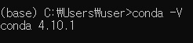
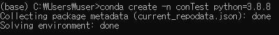
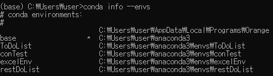
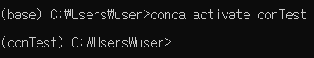
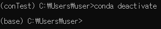
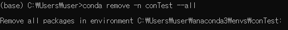
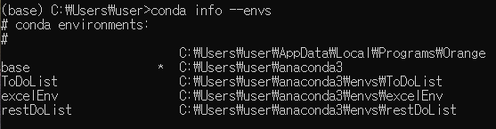

# Conda Command

> conda 가상환경 구성 명령어 정리


### conda version
```bash 
conda -V
```

```bash
conda --version
```




### conda 가상 환경 세팅

##### 가상 환경 생성

```bash
conda create -n <가상 환경 이름> <설치할 파이썬 버전>
```



##### 가상 환경 목록 확인

```bash
conda info --envs 
```



##### 가상 환경 활성화

```bash 
conda activate <가상 환경 이름>
```



- `You may need to close and restart your shell after running 'conda init'.`
  - 화면 오른쪽 >bash을 클릭해서 [Kill Terminal]을 선택한 후 다시 conda activate 실행


##### 가상 환경 비활성화

```bash
conda deactivate 
```



##### 가상 환경 삭제
```bash
conda remove -n <가상 환경 이름> --all
```





