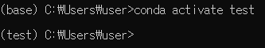
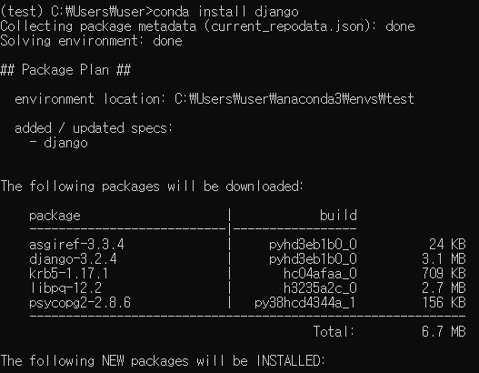
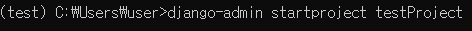
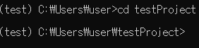
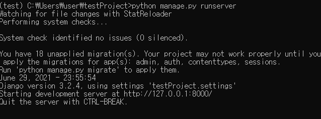
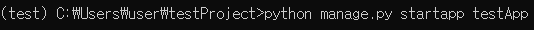
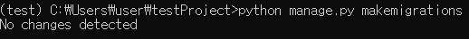
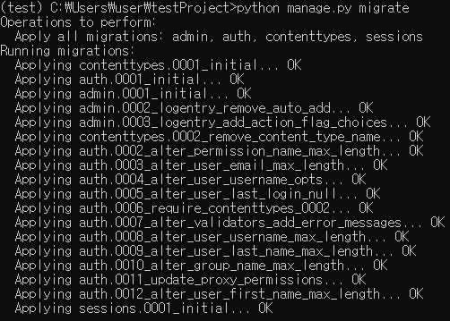
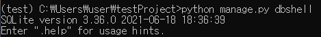
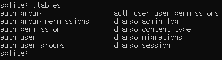

# django 설치

> django를 가상환경에 설치하는 방법 정리


##### 가상환경 활성화

```bash
conda activate <가상 환경 이름>
```




##### django 설치

```bash
conda install django
```



- Proceed([y]/n)? 이라는 말이 뜨면 y 입력


##### django project 생성

```bash
django-admin startproject <프로젝트 이름>
```




##### 생성한 project 위치로 이동

```bash
cd <프로젝트 이름>
```




##### server 실행

```bash
python manage.py runserver
```



- `ctrl + c`로 빠져나올 수 있음

##### application 생성(추가)

```bash
python manage.py startapp <어플리케이션 이름>
```




##### migrations 생성

```bash
python manage.py makemigrations
```




##### model 생성

```bash
python manage.py migrate
```

 


##### model이 생성되었는지 확인

```bash
python manage.py dbshell
```



##### 생성된 table 확인

```bash
.tables
```



##### table 정보 확인

```bash 
pragma table_info(테이블 이름);
```

- 순서 | 이름| 형태| not null여부  | pk 여부


##### table 데이터 검색

```bash
SELECT * FROM 테이블 이름;
```


##### sqlite 종료

```bash
.quit
```