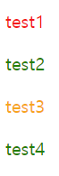
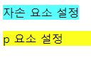
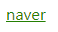
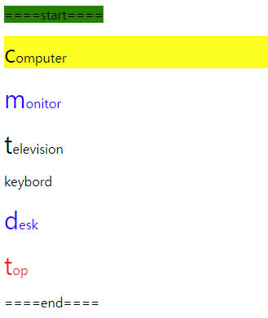
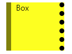
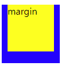
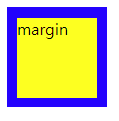
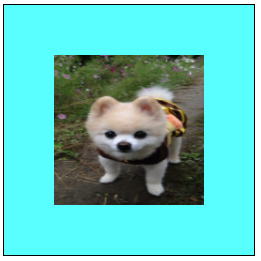

# CSS (Cascading Style Sheet)

> css 정리


### CSS

웹페이지의 요소들에 단계적으로 적용할 수 있는 모임, 웹페이지의 스타일을 정의하여 웹페이지의 요소를 표현하는데 사용


### CSS 구문형식

selector {property:value; property:value}

- `selector`: 스타일이 적용될 범위를 지정하는 선택자

- `property` : 프로퍼티의 이름을 지정

- `value` : 프로퍼티의 값을 지정


스타일은 인라인스타일 , internal스타일, external스타일이 있다.

인라인스타일 > internal스타일> external스타일

​    

p{color:red} -external

p{color:blue} -internal

p{color:green} -inline


### selector 

##### 선택자 우선 순위

`element`: 0001

`class`: 0010

`id`: 0100

- `!important`: 우선 순위 계산이 무시되고 무조건 적용

```html
<style type="text/css">
p{
color: red;
font-size: 20px;
}

.order{
color: green !important;
}

#unit{
color: orange;
}
</style>

<body>
  <p>test1</p>
  <p class="order" id="unit">test2</p>
  <p id="unit">test3</p>
  <p class="order">test4</p>
</body>
```



##### 선택자 조합

|    선택자     |       설명        |
| :-----------: | :---------------: |
|       >       |    자식 선택자    |
|     공백      |    자손 선택자    |
|       +       | 인접(형제) 선택자 |
| [속성명='값'] |    속성 선택자    |
|       ,       |   그룹화 선택자   |


##### element

- `element .class`: 요소의 자손 요소에 설정된 class 속성
- `element.class`: 요소에 설정된 class속성

```html
<style type="text/css">
p.unit{
  background-color: yellow;
}

p .unit {
  background-color: aqua;
}
</style>

<body>
  <p>
    <span class="unit">자손 요소 설정</span>
  </p>
  <p class="unit">p 요소 설정</p>
</body>
```




### pseudo

사용자가 정의한 클래스는 아니지만, 클래스처럼 사용되며 요소의 상태에 따라 스타일을 지정할 때 사용

-  link > visited > hober > active 순서로 지정

`link`

한번도 방문하지 않았던 링크의 스타일

 `visited`

방문했던 링크의 스타일

`hover`

마우스 포인터를 요소에 올렸을때의 스타일

`active`

요소가 활성 상태일때의 스타일

```html
<style type="text/css">
a:link{
  color: red;
}

a:visited{
  color: green;
}

a:hover{
  color: blue;
}

a:active{
  color: orange;
}
</style>

<body>
	<a href="http://www.naver.com">naver</a>
</body>
```



`first-child`

요소가 부모 요소의 첫번째 자식 요소로 사용될 때 스타일 적용

`nth-child`

순서에 따라 요소를 선택, 해당하지 않는 요소도 포함

`nth-of-type`

순서에 따라 요소를 선택, 해당하지 않는 요소는 미포함

`first-letter`

첫 글자에 스타일 적용

`first-line`

첫 줄에 스타일 적용

`before`

요소 앞에 스타일 적용

`after`

요소 뒤에 스타일 적용

```html
<style type="text/css">
P:first-child{
  background-color: yellow;
}
    
p:nth-child(even){
  color: red;
}
    
p:nth-of-type(even){
  color: blue;
}
    
p:first-letter{
  font-size: 30px;
}
    
div:first-line {
  background-color: green;
}

div:before {
  content: "====start===="
}

div:after {
  content: "====end===="
}
</style>

<body>
  <div>
    <p>computer</p>
	<p>monitor</p>
	<p>television</p>
    <span>keybord</span>
	<p>desk</p>
	<p>top</p>
  </div>
</body>
```



##### 

### Box Model

html 요소를 둘러싸고 있는 박스에 대한 정의

- 하나의 요소에 대한 박스는 width(콘텐츠의 넓이), padding(안쪽 여백), border(테두리), margin(바깥쪽 여백)으로 구성

```html
<style type="text/css">
div.aa {
  background-color: yellow;
  width: 80px;
  height: 100px;
  border-left-width: 10px;
  border-right-width: 10px;
  border-left-style: solid;
  border-right-style: dotted;
  border-left-color: olive;
  border-right-color: black;
  padding-left: 10px;
  padding-right: 10px;
  margin-left: 10px;
  margin-right: 10px;
}
</style>
<body>
  <div class="aa">Box</div>
</body>
```



##### margin

```html
<style type="text/css">
#m1{
 width:100px;
 height:100px;
 background-color: blue; 
}

#m2{
  width:80px;
  height:80px;
  background-color: yellow;
  margin:10px;  
}
</style>

<body>
  <div id="m1">
    <div id="m2">margin</div>
  </div>
</body>
```



-  m2의 margin 값이 top에 적용되도록 하기 위해서 설정

```html
<style type="text/css">
#m1{
 width:100px;
 height:99px;
 background-color: blue; 
 padding-top:1px;
}

#m2{
  width:80px;
  height:80px;
  background-color: yellow;
  margin:10px;  
}
</style>

<body>
  <div id="m1">
    <div id="m2">margin</div>
  </div>
</body>
```



### background

`background-image`

배경 이미지 설정

`background-repeat`

배경 이미지 반복 여부 설정

`background-color`

배경 색상 설정

`background-position`

위치 지정

`background-attachment`

배경 이미지를 고정할지, 자신의 컨테이닝 블록과 함께 스크롤할지 지정

`background-clip`

요소의 배경이 테두리, 안쪽 여백, 콘텐츠 상자 중 어디까지 차지할 지 지정

`background-origin`

배경의 원점을 테두리 시작점, 테두리 내부, 안쪽 여백 내부 중 하나로 지정

`background-size`

요소 배경 이미지의 크기를 설정

```html
<style type="text/css">
.dv1 {
  width: 500px;
  height: 500px;
  border: 2px solid black;
  background-image: url('./images/dog.jpg');
  background-size: 300px 300px;
  background-color: aqua;
  background-repeat: no-repeat;
  background-position: center;
  background-attachment: scroll;
}
</style>

<body>
  <div class="dv1"></div>
</body>
```

