# CSS (Cascading Style Sheet)

> css 정리


### CSS

웹페이지의 요소들에 단계적으로 적용할 수 있는 모임, 웹페이지의 스타일을 정의하여 웹페이지의 요소를 표현하는데 사용


### CSS 구문형식

selector {property:value; property:value}

- `selector`: 스타일이 적용될 범위를 지정하는 선택자

- `property` : 프로퍼티의 이름을 지정

- `value` : 프로퍼티의 값을 지정

  

### selector 

##### 선택자 우선 순위

`element`: 0001

`class`: 0010

`id`: 0100

- `!important`: 우선 순위 계산이 무시되고 무조건 적용

```html
<style type="text/css">
p{
color: red;
font-size: 20px;
}

.order{
color: green !important;
}

#unit{
color: orange;
}
</style>

<body>
  <p>test1</p>
  <p class="order" id="unit">test2</p>
  <p id="unit">test3</p>
  <p class="order">test4</p>
</body>
```


##### 선택자 조합

|    선택자     |       설명        |
| :-----------: | :---------------: |
|       >       |    자식 선택자    |
|     공백      |    자손 선택자    |
|       +       | 인접(형제) 선택자 |
| [속성명='값'] |    속성 선택자    |
|       ,       |   그룹화 선택자   |


##### element

- `element .class`: 요소의 자손 요소에 설정된 class 속성
- `element.class`: 요소에 설정된 class속성

```html
<style type="text/css">
p.unit{
  background-color: yellow;
}

p .unit {
  background-color: aqua;
}
</style>

<body>
  <p>
    <span class="unit">자손 요소 설정</span>
  </p>
  <p class="unit">p 요소 설정</p>
</body>
```


### pseudo

사용자가 정의한 클래스는 아니지만, 클래스처럼 사용되며 요소의 상태에 따라 스타일을 지정할 때 사용

-  link > visited > hober > active 순서로 지정

`link`

한번도 방문하지 않았던 링크의 스타일

 `visited`

방문했던 링크의 스타일

`hover`

마우스 포인터를 요소에 올렸을때의 스타일

`active`

요소가 활성 상태일때의 스타일

```html
<style type="text/css">
a:link{
  color: red;
}

a:visited{
  color: green;
}

a:hover{
  color: blue;
}

a:active{
  color: orange;
}
</style>

<body>
	<a href="http://www.naver.com">naver</a>
</body>
```


`first-child`

요소가 부모 요소의 첫번째 자식 요소로 사용될 때 스타일 적용

`nth-child`

순서에 따라 요소를 선택, 해당하지 않는 요소도 포함

`nth-of-type`

순서에 따라 요소를 선택, 해당하지 않는 요소는 미포함

`first-letter`

첫 글자에 스타일 적용

`first-line`

첫 줄에 스타일 적용

`before`

요소 앞에 스타일 적용

`after`

요소 뒤에 스타일 적용

```html
<style type="text/css">
P:first-child{
  background-color: yellow;
}
    
p:nth-child(even){
  color: red;
}
    
p:nth-of-type(even){
  color: blue;
}
    
p:first-letter{
  font-size: 30px;
}
    
div:first-line {
  background-color: green;
}

div:before {
  content: "====start===="
}

div:after {
  content: "====end===="
}
</style>

<body>
  <div>
    <p>computer</p>
	<p>monitor</p>
	<p>television</p>
    <span>keybord</span>
	<p>desk</p>
	<p>top</p>
  </div>
</body>
```


##### 

### Box Model

html 요소를 둘러싸고 있는 박스에 대한 정의

- 하나의 요소에 대한 박스는 width(콘텐츠의 넓이), padding(안쪽 여백), border(테두리), margin(바깥쪽 여백)으로 구성

```html
<style type="text/css">
div.aa {
  background-color: yellow;
  width: 80px;
  height: 100px;
  border-left-width: 10px;
  border-right-width: 10px;
  border-left-style: solid;
  border-right-style: dotted;
  border-left-color: olive;
  border-right-color: black;
  padding-left: 10px;
  padding-right: 10px;
  margin-left: 10px;
  margin-right: 10px;
}
</style>
<body>
  <div class="aa">Box</div>
</body>
```


##### margin

```html
<style type="text/css">
#m1{
 width:100px;
 height:100px;
 background-color: blue; 
}

#m2{
  width:80px;
  height:80px;
  background-color: yellow;
  margin:10px;  
}
</style>

<body>
  <div id="m1">
    <div id="m2">margin</div>
  </div>
</body>
```


-  m2의 margin 값이 top에 적용되도록 하기 위해서 설정

```html
<style type="text/css">
#m1{
 width:100px;
 height:99px;
 background-color: blue; 
 padding-top:1px;
}

#m2{
  width:80px;
  height:80px;
  background-color: yellow;
  margin:10px;  
}
</style>

<body>
  <div id="m1">
    <div id="m2">margin</div>
  </div>
</body>
```


### background

`background-image`

배경 이미지 설정

`background-repeat`

배경 이미지 반복 여부 설정

`background-color`

배경 색상 설정

`background-position`

위치 지정

`background-attachment`

배경 이미지를 고정할지, 자신의 컨테이닝 블록과 함께 스크롤할지 지정

`background-clip`

요소의 배경이 테두리, 안쪽 여백, 콘텐츠 상자 중 어디까지 차지할 지 지정

`background-origin`

배경의 원점을 테두리 시작점, 테두리 내부, 안쪽 여백 내부 중 하나로 지정

`background-size`

요소 배경 이미지의 크기를 설정

```html
<style type="text/css">
.dv1 {
  width: 500px;
  height: 500px;
  border: 2px solid black;
  background-image: url('./images/dog.jpg');
  background-size: 300px 300px;
  background-color: aqua;
  background-repeat: no-repeat;
  background-position: center;
  background-attachment: scroll;
}
</style>

<body>
  <div class="dv1"></div>
</body>
```


### text

`line-height`

줄 높이 간격을 지정하는 스타일

 ` text-indent` 

+값이면 들여쓰기, -값이면 내여쓰기가 지정되는 스타일

`text-align`

텍스트 정렬을 지정하는 스타일

- left: 왼쪽 정렬
- right: 오른쪽 정렬
- justify: 양쪽 정렬
- center: 가운데 정렬

`text-decoration`

텍스트 장식을 지정하는 스타일

`text-transform`

영문자일때 대소문자로 텍스트를 설정하는 스타일

`letter-spacing`

글자 간을 지정하는 스타일

`word-spacing`

단어 간격을 지정하는 스타일

```html
<style type="text/css">
p{
  line-height: 30px;
  text-indent: 30px;
  text-align: left;
  text-decoration: underline;
  text-transform: lowercase;
  letter-spacing: 10px;
  word-spacing: 10px;
}
</style>

<body>
<p>Cascading Style Sheets (CSS) is a stylesheet language used to describe the presentation of a document written in HTML or XML (including XML dialects such as SVG, MathML or XHTML). 
CSS describes how elements should be rendered on screen, on paper, in speech, or on other media.</p>
</body>
```

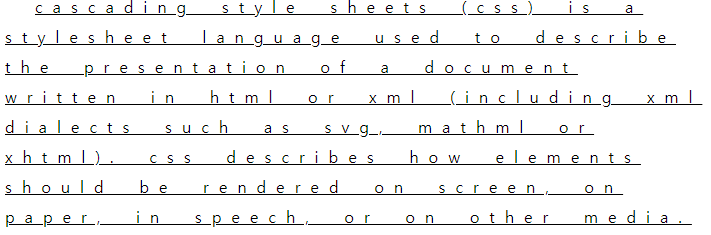


### font

`font-family`

글꼴을 지정하는 스타일

- 한글이나 공백이 있는 속성값들은 묶어서 표현

 `font-style`

폰트 기울임을 지정

- `oblique`: normal 폰트를 기울임

- `italic`: 장식적인 요소가 가미된 기울임

`font-weight`

폰트 굵기를 지정

` font-size`

폰트 크기를 지정

`font-variant`

크기는 그대로 유지하고 소문자를 대문자로 변경

```html
<style type="text/css">
p{
  font-family: serif,"굴림","Times New Roman";
  font-style: italic;
  font-weight: bolder;
  font-size: 20px;
  font-variant: small-caps;
}
</style>

<body>
  <p>폰트 지정</p>
</body>
```

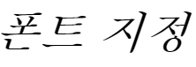

### border

`border-width`

테두리의 두께 지정

`border-style`

테두리의 스타일 지정

`border-color`

테두리의 색상 지정 

```html
<style type="text/css">
.dv1{
  width: 100px;
  height: 100px;
  border-width: 5px 10px 15px 20px;
  border-style: solid dashed double dotted;
  border-color: red orange yellow green;
}
</style>

<body>
  <div class="dv1"></div>
</body>
```

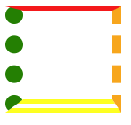

### list

` list-style-type`

list에 기호를 지정

`list-style-position`

- `inside`: 기호가 li요소 안에 배치

- `outside`: 기호가 li요소 밖에 배치

` list-style-image`

기호를 이미지로 표현할때 사용되는 스타일

```html
<style type="text/css">
ul{
  width: 100px;
  height: 100px;
}
ul li{
  border: 1px solid;
  list-style-type: square;
  list-style-position: outside;
  list-style-image: url('./images/icon.png')
}
</style>

<body>
  <ul>
    <li>메뉴</li>
    <li>메뉴</li>
    <li>메뉴</li>
  </ul>
</body>
```

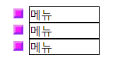

### display

요소의 레벨을 변경해주는 속성

`inline`

새로운 라인에서 시작하지 않고, 요소의 너비도 해당 라인 전체가 아닌 해당 HTML 요소의 내용만큼만 차지

`block`

언제나 새로운 라인에서 시작하며, 해당 라인의 모든 너비를 차지

`inline-block`

해당 요소 자체는 인라인 요소처럼 동작, 하지만 해당 요소 내부에서는 블록 요소처럼 동작

```html
<style type="text/css">
#div1{
  display: inline;
  width: 100px;
  height: 100px;
  margin-bottom: 10px;
  background-color: red;
  border: 1px solid black;
}
#div2{
  display: block;
  width: 100px;
  height: 100px;
  margin-bottom: 10px;
  background-color: yellow;
  border: 1px solid black;
}
#div3{
  display: inline-block;
  width: 100px;
  height: 100px;
  margin-bottom: 10px;
  background-color: blue;
  border: 1px solid black;
}
</style>

<body>
  <div id="div1">display</div>
  <div id="div2">display</div>
  <div id="div3">display</div>
</body>
```

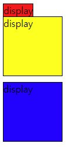


### visibility

요소 박스를 표시하거나 감출때 사용되는 속성

- display:none과 비슷하지만 visibility:hidden은 요소의 원래공간은 유지


### overflow

콘텐츠가 블록박스의 크기를 넘어가는 경우에 사용하는 속성

display:none => 요소의 원래 공간이 없어지면서 요소도 안보임

visibility :hidden => 요소의 원래공간을 유지하면서 요소는 안보임

overflow : hidden => 요소의 범위를 벗어나는 컨텐츠는 안보임

```html
<style type="text/css">
#div1 {
  width: 100px;
  height: 100px;
  background-color: red;
  visibility: hidden;
  height: 0px;
  width: 0px;
  font-size: 0px;
}

#div2 {
  width: 100px;
  height: 100px;
  background-color: blue;
  overflow : hidden;
  height: 0px;
  width: 0px;
  font-size: 0px;
}

#div2 {
  width: 100px;
  height: 100px;
  background-color: yellow;
  overflow : auto;
  height: 0px;
  width: 0px;
  font-size: 0px;
}
</style>

<body>
  <p>before</p>
  <div id=div1>div1</div>
  <div id=div2>div2</div>
  <div id=div3>div3</div>
  <p>after</p>
</body>
```

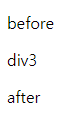


### float

박스의 위치를 부모요소의 안에서 왼쪽 또는 오른쪽으로 이동시키는 기능

- float가 지정된 박스는 문서의 일반적인 흐름에 영향을 받지 않으면서 이동된 위치에 떠 있음

```html
<style type="text/css">
.wrap {
  width: 900px;
  height: 500px;
  background-color: yellow;
}
#nav{
  width:250px;
  height:300px;
  background-color: green;
  float: right;
}

#section{
  width:600px;
  height:300px;
  background-color: olive;
  float: right;
}

#footer{
  width:900px;
  height:100px;
  background-color: navy;
  float: left;
}
</style>

<body>
	<div class="wrap">
		<div class="box1" id="nav"></div>
		<div class="box2" id="section"></div>
		<div class="box3" id="footer"></div>
	</div>
</body>
```

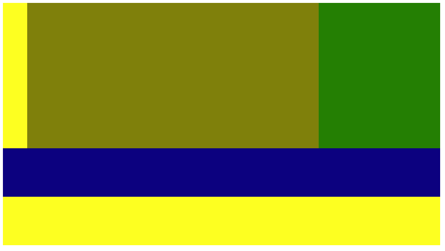


### menu

```html
<style type="text/css">
* {
  margin: 0;
  padding: 0;
  border: 0
}
    
.menulist {
  width: 294px;
  height: 34px;
  background-color: aqua;
  border-left: 2px solid;
}
    
dl.menulist dt {
  width: 0px;
  height: 0px;
  font-size: 0px;
  visibility: hidden;
  text-indent: -2000px;
}
    
dl.menulist dd {
  border: 2px solid;
  float: left;
  border-left-width: 0px;
  width: 96px;
  height: 30px;
}

dl.menulist dd a {
  width: 96px;
  height: 30px;
  display: block;
  text-align: center;
  line-height: 30px;
  text-decoration: none;
  color: #000000;
  font: bold 16px/30px nanumgothic, "굴림체", doyum, sanf-serif;
}

dl.menulist dd a:hover{
  text-decoration: underline;
  color: red;
  font-size: 18px;
}
</style>

<body>
  <dl class="menulist">
    <dt>메뉴목록</dt>
    <dd>
	  <a href="#">공지사항</a>
	</dd>
	<dd>
	  <a href="#">이벤트</a>
	</dd>
	<dd>
	  <a href="#">Q&A</a>
	</dd>
	</dl>
</body>
```

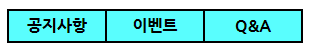

### position

박스에 대한 배치를 변경할때 사용

- `static`: 순서에 의한 기본 위치를 지정
- `absolute` : 부모 요소를 기준으로 위치를 지정 (원래의 위치값을 잃음)
- `relative` : 자기 자신을 기준으로 위치를 지정 (원래의 위치값을 가지고 있음)
- `fixed` : 스크린을 기준으로 위치를 지정 (원래의 위치값을 잃음)

```html
<style type="text/css">
*{
  margin: 0;
  padding: 0;
  border-width: 0;
}
    
.box1{
  width:500px;
  height: 100px;
  background-color: blue;
  position: static;
}

.box2 {
  width: 500px;
  height: 200px;
  background-color: yellow;
  position: relative;
}

.box3 {
  width: 100px;
  height: 100px;
  background-color: red;
  position: absolute;
  left: 50px;
  top: 50px;
}

.box4 {
  width: 100px;
  height: 100px;
  background-color: green;
  position: fixed;
  left: 200px;
}

</style>
</head>
<body>
  <div class="box1"></div>
  <div class="box2">
  <div class="box3"></div>
  <div class="box4"></div>
</div>

</body>
```

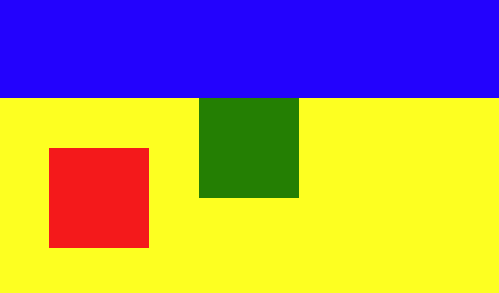


### z-index

화면상에서 요소들이 겹쳐있을때 요소의 위치를 나타내는 속성

```html
<style type="text/css">
div {
  width: 100px;
  height: 100px;
  position: absolute;
}
    
#aa {
  background-color: red;
  top: 0px;
  left: 0px;
  z-index: 1;
}

#bb {
  background-color: green;
  top: 10px;
  left: 10px;
  z-index: 2;
}

#cc {
  background-color: blue;
  top: 20px;
  left: 20px;
  z-index: 3;
}
</style>

<body>
  <div id="aa">red</div>
  <div id="bb">green</div>
  <div id="cc">blue</div>
</body>
```

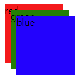

### white-space

스페이스와 탭, 줄바꿈, 자동줄바꿈을 어떻게 처리할지 정하는 속성

|          | 스페이스와 탭 | 줄바꿈 | 자동 줄바꿈 |
| :------: | :-----------: | :----: | :---------: |
|  normal  |     병합      |  병합  |      O      |
|  nowrap  |     병합      |  병합  |      X      |
|   pre    |     보존      |  보존  |      X      |
| pre-wrap |     보존      |  보존  |      O      |
| pre-line |     병합      |  보존  |      O      |

```html
<style type="text/css">
p{
  font-family: "굴림체";
  font-size: 16px;
}
.t{
  font-weight: bold;
  color: purple;
}
.a{
  white-space: normal;
}
.b{
  white-space: nowrap;
}
.c{
  white-space: pre;
  background-color: aqua;
}
.d{
  white-space: pre-wrap;
  background-color: yellow;
}
.e{
  white-space: pre-line;
}
</style>

<body>
<p class="t"> white-space: normal;</p>
<p class="a">    Cascading Style Sheets (CSS) is a stylesheet language used to describe the presentation of a document written in HTML or XML (including XML dialects such as SVG, MathML or XHTML).
CSS describes how elements should be rendered on screen, on paper, in speech, or on other media.</p>
    
<p class="t">white-space: nowrap;</p>
<p class="b">    Cascading Style Sheets (CSS) is a stylesheet language used to describe the presentation of a document written in HTML or XML (including XML dialects such as SVG, MathML or XHTML). 
CSS describes how elements should be rendered on screen, on paper, in speech, or on other media.</p>
    
<p class="t">white-space: pre;</p>
<p class="c">    Cascading Style Sheets (CSS) is a stylesheet language used to describe the presentation of a document written in HTML or XML (including XML dialects such as SVG, MathML or XHTML). 
CSS describes how elements should be rendered on screen, on paper, in speech, or on other media.</p>
    
<p class="t">white-space: pre-wrap;</p>
<p class="d">    Cascading Style Sheets (CSS) is a stylesheet language used to describe the presentation of a document written in HTML or XML (including XML dialects such as SVG, MathML or XHTML). 
CSS describes how elements should be rendered on screen, on paper, in speech, or on other media.</p>
    
<p class="t">white-space: pre-line;</p>
<p class="e">    Cascading Style Sheets (CSS) is a stylesheet language used to describe the presentation of a document written in HTML or XML (including XML dialects such as SVG, MathML or XHTML). 
CSS describes how elements should be rendered on screen, on paper, in speech, or on other media.</p>
</body>
```

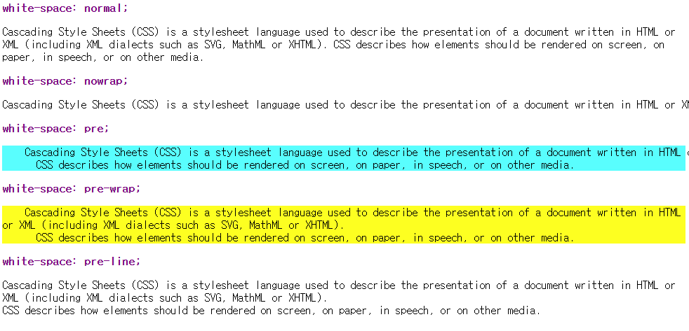

