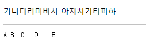
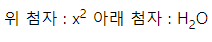

# HTML

> HTML 문서를 생성하는 기본 요소 정리


### core 속성

여러 요소들에서 공통적으로 사용되는 속성

- html, head, meta, script, style, title요소에서는 사용 불가능

 `name` 

요소에 이름을 지정할때 사용되는 속성

- 클라이언트에 보내준 데이터를 서버에서 받을때 name 속성에 지정된 값을 통해서 받음

`id` 

페이지에서 요소에 대한 고유값을 지정할때 사용되는 속성

- 중복된 값을 지정할 수 없음

`class` 

여러 요소들에 공통적인 스타일을 적용시킬때 사용되는 속성

- 요소들을 그룹화할때 사용

`style` 

요소내부에서 직접적으로 스타일을 지정할때 사용되는 속성

`title`

요소에 대한 설명을 지정할때 사용되는 속성


### HTML(HyperText Markup Language) 구조

```html
<!DOCTYPE html>

<html>
 <head>
  <meta charset="utf-8">
  <title>title</title>
 </head>

 <body>
     
 </body>
</html>
```


### 메인 루트

`<html>`

HTML 문서의 최상단 요소로, 모든 다른 요소는 <html> 요소의 후손이어야 함


### 문서 메타데이터

`<head>`

기계가 식별할 수 있는 메타 데이터를 담음, 제목

`<title>`

브라우저의 제목 표시줄이나 페이지 탭에 보이는 문서 제목 정의

`<meta>`

다른 메타 관련 요소로 나타낼 수 없는 Metadata를 나타냄

`<style>`

문서나 문서 일부에 대한 스타일 정보 포함


### 구획 루트

`<body>`

HTML 문서의 내용을 나타냄, 한 문서에 하나의 요소만 존재할 수 있음

```html
<body>

 </body>
```


### 콘텐츠 구획

`<h1> ~ <h6>`

문서의 제목을 나열할 때 사용

```html
<body>
  <h1>heading 1</h1>
  <h2>heading 2</h2>
  <h3>heading 3</h3>
  <h4>heading 4</h4>
  <h5>heading 5</h5>
  <h6>heading 6</h6>
</body>
```


`<address>`

가까운 HTML 요소의 사람, 단체, 조직 등에 대한 연락처 정보를 나타냅

```html
<body>
  <address> 
  서울시 강남구<br/>
  tel : 000-1111-2222
 </address>     
</body>
```


### 텍스트 콘텐츠

`<p>`

텍스트를 단락(문단)으로 정의할 때 사용

- 블록 요소가 아닌 인라인 요소와 텍스트만 사용할 수 있음

`<pre>`

정형화된 텍스트를 나타냄, 실행을 했을 때 입력된 모양 그대로 출력

`<hr/>`

수평선을 표시 

```html
<body>
	<p>가나다라마바사 아자차가타파하</p>
    <hr/>
    <pre>A B  C   D    E
    </pre>
 </body>
```



`<div>`

플로우 콘텐츠를 위한 통용 컨테이너, css로 꾸미기 전에는 콘텐츠나 레이아웃에 영향을 주지 않음

`<blockquote>`

블록요소와 텍스트만 포함, 들여쓰기로 표현

```html
<body>
  <div style="background-color:red">
    소크라테스는 <blockquote>너 자신을 알라.
    </blockquote>라는 명언을 남겼다.
  </div>
</body>
```


`<ul>`

비순서적 목록을 표현할 때 사용

`<ol>`

순서가 있는 목록을 표현할 때 사용

`<dl>`

정의형 목록이나 주종관계에 있는 내용을 표현할 때 사용

```html
<body>
  <h1>동물</h1>
    <ul>
      <li>시계</li>
      <li>가방</li>
      <li>수첩</li>
    </ul>

  <h1>예매 순서</h1>
    <ol>
      <li>영화관 입장</li>
      <li>영화 선택</li>
      <li>영화 예매</li>
    </ol>
  
  <dl>
    <dt>CSS</dt>
    <dd>
    웹페이지의 요소들에 단계적으로 적용할 수 있는 스타일들의 모임
    </dd>
  </dl>
</body>
```


### 인라인 텍스트 시멘틱

`<a>`

href 특성을 통해 URL로 연결할 수 있는 하이퍼링크 생성

```html
<body>
  <a href="http://www.daum.net">daum</a>
</body>
```


`<br/>`

줄 바꿈을 표시

`<em>`

약한 강조 의미

`<strong>`

강한 강조 의미

`<i>`

기울게 표현

`<b>`

굵게 표현

```html
<body>
  <em>약한 강조</em>
  <strong>강한 강조</strong>
  <br/>
  <i>기울기</i>
  <b>굵기</b>
</body>
```


`<sup>`

SuperScript, 위 첨자를 의미

`<sub>`

SubScript, 아래 첨자를 의미

```html
<body>
  위 첨자 : x<sup>2</sup>
  아래 첨자 : H<sub>2</sub>O  
</body>
```



`<span>`

구문 콘텐츠를 위한 통용 인라인 컨테이너, 스타일을 적용하기 위해서 또는 어떤 특성의 값을 서로 공유하는 요소를 묶을 때 사용할 수 있음

`<q>`

인라인 요소와 텍스트를 포함, 쌍따옴표로 표시

```html
<body>
  <span style="background-color:yellow">
    소크라테스는 <q>너 자신을 알라.
  	</q>라는 명언을 남겼다.
  </span>
</body>
```


`<abbr>`

준말 또는 머리글자

```html
<body>
    <abbr title="Apartmention">Apt.</abbr> 
</body>
```


### 수정사항 표시

`<del>`

삭제된 텍스트 의미, 가운데 그은 선 표시

`<ins>`

추가된 텍스트 의미, 밑줄 표시

```html
<body>
  정가 : <del>10,000</del>원
  할인가 : <ins>5,000</ins>원
</body>
```


### 표 콘텐츠

`<table>`

2차원  격자모양의 표를 표시

`<tr> `

표에서 행 구분

` <td> `

표에서 열 구분

- `colspan`: 열 병합 설정

- `rowspan`: 행 병합 설정

`<th> `

표에서 제목 표시

`<caption>`

표 제목 표시

 ` <thead>` 

행그룹설정할때 제목 그룹 설정

 ` <tfoot> `

행그룹설정할때 꼬리 그룹 설정

 `<tbody> `

행 그룹설정할때 내용 그룹 설정

```html
<body>
  <table>
    <caption>과일 판매</caption>
    <thead>
      <tr>
        <th>과일명</th>
        <th>가격</th>
      </tr>
    </thead>
        
    <tfoot>
      <tr>
        <td>합계</td>
        <td>10,000원</td>
      </tr>
    </tfoot>
        
    <tbody>
      <tr>
        <td>사과</td>
        <td>3,000원</td>
      </tr>
      <tr>
        <td>수박</td>
        <td>7,000원</td>
      </tr>
    </tbody>
  </table>
</body>
```


