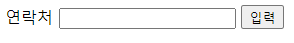
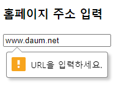

# HTML FORM

> HTML form 요소 정리


### form

웹 문서에서 서로 상호작용 할 수 있도록 하는 역할을 담당

```html
<body>
  <form>
 
  </form>
</body>
```


### form 요소

`<fieldset>` 

여러 개의 폼 요소를 그룹화 할때 사용

`<legend>` 

폼 요소 그룹화 설정된 것에 대한 제목을 지정

`<label>`

텍스트와 폼 요소의 상관 관계를 설정

`<input>`

대화형 컨트롤 폼들을 생성하는데 사용

```html
<form>
  <fieldset>
  <legend>로그인</legend>
  <label for="id">아이디</label> 
  <input type="text" name="id" id="id"/>
  <label for="pass">비밀번호</label> 
  <input type="password" name="pass" id="pass"/>
  </fieldset>
  <input type="submit" value="로그인">
</form>
```


`<datalist>`

form요소에서 미리 지정된 옵션 목록을 제공, 사용자들이 특정 글자를 입력하면 그에 해당하는 미리 지정된 목록을 보여줌

- `<input>` 요소에서 list의 속성값과 datalist의 id값이 일치해야함

```html
<form>
  <label for="subject">과목 입력</label>
  <input type="text" list="subjectlist" 
		 name="subject" id="subject"> 
		 <datalist id="subjectlist">
		   <option value="korean">국어</option>
		   <option value="math">수학</option>
		   <option value="english">영어</option>
		 </datalist><br/>
  <input type="submit" value="완료"> 
</form>
```


 `<select> `

셀렉트 박스(드롭다운)를 표시

`<option> `

셀렉트 박스에 포함될 항목들을 정의 하기 위해 사용

- `selected`: 여러 개의 항목 중 선택된 항목을 표시하기 위해 사용
- `value`: 각 항목 값을 지정하기 위해 사용

```html
<form action="process.jsp" >
  <select name="subject">
    <option value="java" selected="selected">JAVA</option>
    <option value="jsp">JSP</option>
    <option value="html5">HTML5</option>
    <option value="jquery">jQuery</option>
  </select>
  <input type="submit" value="commit"/>
</form>
```


`<textarea>`

여러 줄을 입력할 수 있는 박스 표시

- `cols`: 세로 줄 수 설정
- `rows`: 가로 줄 수 설정
- `disabled`: 화면에 표시는 하되 데이터를 수정할 수 없도록 비활성화 상태로 표시

```html
<form action="html_018_process.jsp" method="post">
  <h3>TextArea</h3>
  <textarea name="other" rows="10" cols="10"> 활성화
  </textarea>
  <textarea name="other2" rows="10" cols="10"            
   			disabled="disabled"> 비활성화
  </textarea>
</form>
```


### form 속성

`action`

form의 내용을 처리하기 위한 서버 URI를 설정

`method` 

클라이언트의 데이터를 서버로 보내기 위한 방법을 설정

- `get`: 폼의 내용을 서버로 전송할때 255바이트 이하까지만 전송할 수 있고 주소표시줄에 전송되는 값이 노출

- `post `: 폼의 내용을 서버로 전송할때 255바이트보다 크거나 보안이 필요한 데이터를 보낼때 설정

`enctype `

post 방식으로 전송되는 데이터의 타입을 설정

- 전송할 데이터에 첨부파일이 없을때는 enctype="application/x-www-form-urlencoded" 를 지정
- 전송할 데이터에 첨부파일이 있을때는  enctype="multipart/form-data" 를 지정

`for`

속성 값으로 포커스를 이동하기 위해서 설정

```html
<form action="process.jsp" method="get" 
      enctype="application/x-www-form-urlencoded">
    
  <label for="phone">연락처</label> 
  <input type="text" name="phone" id="phone"/>
  
  <input type="submit" value="입력">
</form>
```




### input 유형

`text`

한 줄의 텍스트 필드

`password`

값이 가려진 한줄 텍스트 필드

`email`

input에 입력한 값이 이메일 형식(@)에 맞는지 확인

```html
<form>
  <h3>아이디</h3>
  <input type="text" size=10/>
    
  <h3>비밀번호</h3>
  <input type="password" size=10/>
  
  <h3>이메일</h3>  
  <input type="email" size=10/>
  <input type="submit" value="제출">
</form>
```


`checkbox`

단일 값을 선택하거나 선택 해제할 수 있는 체크박스

`radio`

같은 name 값을 가진 여러개의 선택중에서 하나의 값을 선택

`submit`

양식을 전송하는 버튼

`reset`

양식의 내용을 디폴트값(기본값)으로 초기화하는 버튼

```html
<form action="process.jsp">
  <h3>체크박스</h3>
  <input type="checkbox" name="subject" value="java"/>자바
  <input type="checkbox" name="subject" value="database"/>데이터베이스
  <input type="checkbox" name="subject" value="spring"/>스프링
   
  <h3>라디오버튼</h3>
  <input type="radio" name="fruit" value="apple"/>사과
  <input type="radio" name="fruit" value="melon"/>메론
  <input type="radio" name="fruit" value="grape"/>포도
  
  <p>
  <input type="reset" value="reset"/>
  <input type="submit" value="commit"/>
  </p>
</form>
```


`color`

색상 칩에서 원하는 색상 선택

```html
<form>
  <h3>색상 선택</h3>
  <input type="color" name="color_value" 
		 value="#0000ff"><br/>
</form>
```


`number`

숫자 입력

`range`

특정 범위의 숫자 선택

- `min`: 최솟값 지정
- `max`: 최댓값 지정
- `step`: 증가 값 지정

```html
<form>
  <h3>숫자 입력</h3>
  <input type="number" name="count" min="0" max="100">
    
  <h3>숫자 선택</h3>
  <input type="range" name="point" min="0" max="100">
</form>
```


`date`

년-월-일 단위로 날짜 입력

`month`

년-월 단위로 날짜 입력

`week`

년-주 단위로 날짜 입력

`time`

시간만 입력

`datetime-local`

년-월-일-시간 단위로 입력, 크롬에서만 사용

```html
<form>
  <h3>오늘 날짜 입력</h3>
  <input type="date" name="today">
    
  <h3>생일(년/월) 입력</h3> 
  <input type="month" name="birth">
    
  <h3>주간 계획(년/주) 입력</h3> 
  <input type="week" name="weekeend">
    
  <h3>현재 시간 입력</h3>
  <input type="time" name="Now">
    
  <h3>생일(년도, 월, 일, 시간) 입력</h3>
  <input type="datetime-local" name="bdaytime">
</form>
```


`url`

입력란에 http:// 가 앞자리에 와야함

```html
<form>
  <h3>홈페이지 주소 입력</h3>
  <input type="url" name="homepage">
</form>
```



### layout

화면을 분할하거나 배열하여 구성하는 것, HTML5 웹 표준에서는 각 영역을 구분하는 구조적 태그 요소를 정의하여 사용

`<header>`

HTML5 문서의 머리말 영역으로 중요한 정보를 표시

`<nav>`

내비게이션(navigation) 영역으로 웹 사이트 내에 분류된 다른 영역으로 이동할 때 사용

`<section> `

문서의 영역을 구성할 때 사용. `<header>`, `<article>` 등을 포함할 수 있음

`<article>` 

독립된 주요 콘텐츠 영역을 정의. 하나의 `<section>` 태그 내에 여러 개의 `<article>` 태그를 구성할 수 있음

`<aside>` 

주요 콘텐츠 이외에 남은 콘텐츠를 표시

`<footer>`

사이트의 자세한 정보를 표시

```html
<header>
  <h3>제목</h3>
    <nav>메뉴1</nav>
    <nav>메뉴2</nav>
</header>
<hr/>

<section>
  <article>
    <header>
	<h5>부제목</h5>
	</header>
	<p>부 세션 영역</p>
  </article>
</section>

<aside>
  <h3>부가</h3>
  <p>부가적 정보 제공</p>
</aside>
<hr/>

<footer>
  <small>사이트 정보 표시</small>
</footer>
```


