# java script

> 문서가 동작하도록 하는 java script 정리


### 삽입 방식

`<head>` 영역에 삽입

- 브라우저 렌더링에 방해가 되어 무거운 스크립트가 실행되는 경우 오랫동안 완성되지 못한 화면을 노출

- 문서를 초기화하거나 설정하는 가벼운 스크립트들이 자주 사용

`<body>` 영역에 삽입

- 브라우저가 렌더링이 완료된 상태에서 스크립트가 실행되기에 콘텐츠를 변경하는 스크립트의 경우 화면에 노출된 채로 변화

- 대부분의 스크립트의 위치로 추천되는 위치

```html
<head>
  <script type="text/javascript">
  </script>
</head>
<body>
  <script type="text/javascript">
  </script>
</body>
```


### var

자바 스크립트에서 메모리 공간을 확보하기 위해 변수 선언시 사용

- 규칙
  - 첫번째 문자는 A-Z, a-z, _, $만 사용

  - 나머지 문자는 A-Z, a-z, 0-9를 사용

  - 자바스크립트 예약어는 사용할 수 없음

```html
<script type="text/javascript">
var n1 = 10; 
var n2;

function process() {
  var n3 = 'korea'
  
  document.write(n1 + " " + typeof(n1) + "<br/>"); 
  document.write(n2+" "+typeof(n2) + "<br/>")
  document.write(n3+" "+typeof(n3) + "<br/>")
}

process();
</script>
```

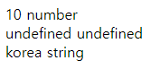


### data type

|      타입       |                             특징                             |
| :-------------: | :----------------------------------------------------------: |
|  숫자(number)   | 자바스크립트는 정수 값과 실수 값을 구분하지 않음<br />모든 숫자는 IEEE 754표준에 의해 정의된 8바이트 크기의 실수로 표현 |
| 문자열(string)  |  유니코드 문자나 숫자, 문장부호들의 시퀀스로 텍스트를 표현   |
| 불리언(boolean) |   참/거짓의 진리 값 두개를 표현, true 또는 false값을 가짐    |
|   배열(array)   | 데이터 값들의 모음<br />배열명 다음에 대괄호( [ ])로 둘러싼 인덱스를 써서 값을 가져올 수 있음 |
|  객체(object)   | 이름이 붙은 값들의 모음, 이름이 붙은 값들을 프로퍼티라고 함<br /> 객체 프로퍼티는 객체명 다음에 점(.)과 프로퍼티명을 붙이거나,<br /> 객체명 다음에 대괄호( [ ])로 둘러싼 프로퍼티명의 문자열을 써서 접근 |
| 함수(function)  | 객체 프로퍼티에 할당 될 수 있는 실행가능한 코드를 가지고 있는 데이터 타입 |
|      null       | 보통 참조 타입과 함께 쓰여 어떠한 객체도 나타내지 않는 특수한 값으로 사용 |
|    undefined    | 변수는 선언되었으나 값이 할당된 적이 없는 변수에 접근하거나, <br />존재하지 않는 객체 프로퍼티에 접근할 경우 반환되는 값 |


### operator

- 산술 연산자

- 문자결합 연산자 (`+`)

- 대입 연산자

- 증감 연산자 (`++`, `--`)

- 비교 연산자 (`===`,` !==`, `==`, `!=`)

```html
<script type="text/javascript">
var x = 10;
var y = '10';
    
document.write('x==y: '+ (x==y) + "<br/>");
document.write('x===y: '+ (x===y) + "<br/>");
</script>
```

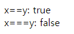

- 논리 연산자

- 삼항조건 연산자

- 데이터 타입 연산자 (`typeof`,  `instanceof`)


### statement

##### 선택문

- `if~else`

- `switch~case`

##### 반복문

- `for`
- `while`
- `do~while`
- `for~in`

##### 기타

- `break`


### print

`document`

```html
<script type="text/javascript">
var v1 = 'java';
var v2 = 'script';
    
document.write(v1 + '<br/>' + v2);
</script>
```

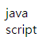

`window`

```html
window.alert(v1 + '\n' + v2)
```

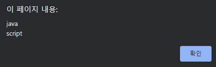

`console`

```html
console.log(v1 + '  ' + v2)
```

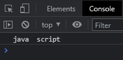


### object

##### Number

최대값, not-a-number, 무한대와 같은 숫자 상수를 위한 속성 포함

```html
<script type="text/javascript">
var data = 5;
var obj = new Number(data);
    
document.write(typeof data + "<br/>")
document.write(typeof obj + "<br/>");
</script>
```

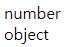

##### String

문자 관련 메서드 포함

```html
<script type="text/javascript">
var data = '5';
var obj = new String(data);
    
document.write(typeof data + "<br/>")
document.write(typeof obj + "<br/>");
</script>
```

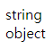

- `valueof()`: 객체에 저장된 값을 리턴

```html
<script type="text/javascript">
var number = 5;
var string = '5';
var num = new Number(number).valueOf()
var str = new String(string).valueOf()
  
document.write(typeof num.valueOf() +"<br/>");
document.write(typeof str.valueOf()+"<br/>");
</script>
```

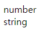

##### Date

날짜 설정, 가져 오기 및 조작을 위한 메서드 포함

```html
<script type="text/javascript">
var date = new Date();
    
document.write(date + "<br/>");
document.write(date.getFullYear() + "<br/>");
document.write(date.getMonth() + 1 + "<br/>");
document.write(date.getDate() + "<br/>");
document.write(date.getDay() + "<br/>");
</script>
```

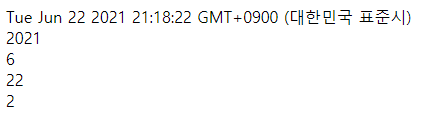


##### Math

수학 상수 및 함수에 대한 속성 및 메서드를 포함

```html
<script type="text/javascript">
document.write(Math.max(10,20,30,40,50,60) +"<br/>");
document.write(Math.min(10,20,30,40,50,60)+"<br/>");
document.write(Math.pow(2,3)+"<br/>");
</script>
```

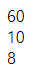

##### Array

배열을 생성할 때 사용하는 리스트 형태의 고수준 오브젝트

- `join`: 배열 요소를 문자열로 결합
- `push`: 배열 끝에 항목 추가
- `pop`: 배열 끝에 항목 제거
- `splice`: 인덱스 위치에 있는 항목 제거
- `sort`: 배열 요소 정렬 (오름차순)
  - `reverse`: sort 뒤에 써주면 내림차순 정렬
- `unshift`: 배열 앞에 항목 추가
- `shift`: 배열 앞에 항목 제거
- `copyWithin`:  인덱스 위치에 n번째 인덱스부터 요소를 복사
- `forEach`: 배열의 항목들을 순환하면서 처리

```html
<script type="text/javascript">
var fruits = [ "Banana", "Orange", "Apple", "Mango" ];
    
document.write(fruits.join('|') + "<br/>");
document.write(fruits + "<br/>");
document.write("<hr/>");
    
document.write(fruits.push("Melon") + "<br/>");
document.write(fruits + "<br/>");
document.write("<hr/>");
    
document.write(fruits.pop() + "<br/>");
document.write(fruits+"<br/>");
document.write("<hr/>");
    
document.write(fruits.splice(2,1,"Lemon","Kiwi")+"<br/>");
document.write(fruits+"<br/>");
document.write("<hr/>");
    
document.write(fruits.sort() + "<br/>"); 
document.write(fruits.sort().reverse() + "<br/>");
document.write("<hr/>");
    
document.write(fruits.unshift("Strawberry")+ "<br/>");
document.write(fruits + "<br/>");
document.write("<hr/>");
    
document.write(fruits.shift()+"<br/>");
document.write(fruits + "<br/>");
document.write("<hr/>");
    
document.write(fruits.copyWithin(2, 0)+"<br/>");
document.write(fruits + "<br/>");
</script>
```

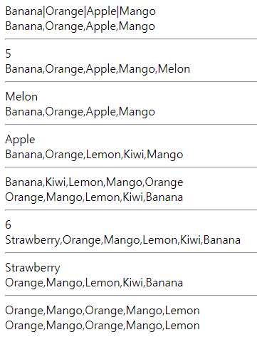


##### Boolean

논리형 객체 

- 문자가 존재하면 True 반환
- 공백, 0, null, undefined, 문자와 숫자의 계산식이면 False 반환

```html
<script type="text/javascript">
document.write(Boolean(10 > 5) + "<br/>");
document.write(Boolean("java") + "<br/>");
        
document.write(Boolean(0) + "<br/>");
document.write(Boolean("")+"<br/>"); 
document.write(Boolean(3/"H")+"<br/>"); 
document.write(Boolean(undefined)+"<br/>");
document.write(Boolean(null)+"<br/>");
</script>
```

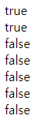


##### RegExp

 패턴을 사용해 텍스트를 판별할 때 사용

```html
new RegExp(pattern[, flags])
```

- 방법
  - 리터럴 표기법:  두 빗금으로 감싸야 하며 따옴표를 사용하지 않음 
  - 생성자 함수: 빗금으로 감싸지 않으나 따옴표를 사용
- flags
  - `i`: 대소문자를 구분하지 않음
  - `g`: 문자열 내 모든 패턴을 검색
  - `m`: 문자열의 행이 바뀌더라도 계속 검색
- pattern
  - `.`: 임의의 문자 1개
    - `+`: 앞선 패턴 반복 
    - `|`: or
    - `[-]`: 범위 지정
    - `\d`: 숫자
    - `\w`: 알파벳과 숫자
- 메서드
  - `exec`: 대응되는 문자열을 찾아 정보를 가지고 있는 배열을 반환, 대응되는 문자열을 찾지 못하면 null을 반환
  - `test`: 대응되는 문자열이 있는지 검사, True나 False를 반환

```html
<script type="text/javascript">
var str = "The BEst things in best life are best free";
var ex1 =/e/;

document.write(ex1.test(str)+"<br/>");
document.write(ex1.exec(str)+"<br/>");

var ex2 = new RegExp("F","ig");
document.write(ex2.test(str)+"<br/>");
document.write(ex2.exec(str)+"<br/>");
</script>
```

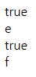


### global 객체

##### number 변환

`Number()`

boolean 데이터 타입도 True는 1, False는 0으로 반환

`parseInt()`

정수형 숫자를 나타냄, boolean 데이터 타입은 반환 불가

`parseFloat()`

실수형 숫자를 나타냄, boolean 데이터 타입은 반환 불가

```html
<script type="text/javascript">
var m="2.3";
    
document.write(Number(m)+" "+typeof Number(m)+"<br/>");
document.write(parseInt(m)+"  "+typeof parseInt(m)+"<br/>");
document.write(parseFloat(m)+"   "+typeof parseFloat(m)+"<br/>");
</script>
```

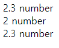

##### eval(String)

수식의 결과를 반환, 문자열을 숫자로 반환

 ```html
 <script type="text/javascript">
 var data = eval("3+2");
   document.write(typeof data+" data="+data+"<br/>");
 </script>
 ```

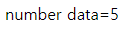

### string

`length`

문자열의 길이 반환

`slice(start, end)`

start부터 end까지 데이터 반환

`substring(start, end)`

start부터 end까지 데이터 반환, 음수 값은 지원하지 않음

`substr(start, length)`

start부터 length 길이까지 데이터 반환

`replace`

문자열 대체

`toUpperCase`

전부 대문자로 변경

`toLowerCase`

전부 소문자로 변경

`concat`

데이터 사이에 원하는 기호 삽입

`split`

특정 기호로 데이터 분할

`match`

검색 데이터와 일치하는지 확인, 일치하는 문자열이 없으면 null 반환

`search`

검색 데이터와 일치하는지 확인, 일치하는 문자열이 없으면 -1 반환


##### 