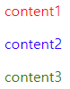

# 문서 객체 모델

> java script 문서 객체 모델 정리


### DOM(Document Object Model)

(x)html문서의 구조

- 자바스크립트를 사용하여 문서 객체를 선택하고 속성 및 스타일(css)을 적용하기 위해서 사용

- IE8 이하버전과 그외 파이어폭스, 크롬, 사파리 등의 브라우저 간에 호환성이 떨어짐

- 트리 구조로 되어 있음

  - 노드(node): root(html)요소를 기준으로 가지처럼 뻗어나가는 것

    - `nodeType`: 노드 고유의 타입을 저장, 수정할 수 없는 읽기 전용 파라미터
    - `nodeName`: 노드 고유의 이름을 저장, 수정할 수 없는 읽기 전용 파라미터
    - `nodeValue`: 노드의 값 저장

    |                           | nodeType | nodeName | nodeValue |
    | :-----------------------: | :------: | :------: | :-------: |
    |  요소노드(element node)   |    1     |  요소명  |   null    |
    | 속성 노드(attribute node) |    2     |  속성명  |  속성값   |
    |   텍스트노드(text node)   |    3     |  #text   |  문자열   |

- 선택자
  - 직접 선택자: 직접 문서에서 요소를 선택
    - id, 요소명, 폼명
  - 인접 선택자: 특정 요소를 기준으로 인접해 있는 요소를 선택
    - `parentNode`: 부모 노드
    - `childNodes`: 자식 노드 리스트
    - `firstChild`: 첫번째 자식 노드
    - `previousSibling`: 이전 형제 노드
    - `nextSibling `: 다음 형제 노드

  ```html
  <script>
  window.onload=function(){
    var p2 = document.getElementById('p2');
      
    p1.parentNode.style.color = 'blue';
    p2.previousSibling.style.color='red';
    p2.nextSibling.style.color='green';
          }
  </script>
  
  <body>
    <div id="wrap">
      <p id="p1">content1</p>
      <p id="p2">content2</p>
      <p id="p3">content3</p>
    </div>
  </body>
  ```

