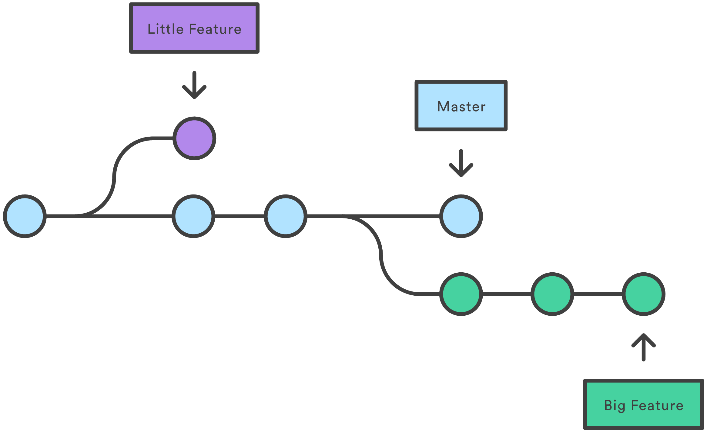

# Git Branch

> Giy 브랜치 정리



##### branch

Git에 branch를 생성하거나 확인하는 명령어


- 기본 사용법
  - branch name을 생략하면 Git에 만들어진 branch를 확인할 수 있음
  - `-d`: branch를 삭제하기 위한 옵션

```bash
git branch <branch name>
```


##### switch

Git에 만들어진 branch 사이를 이동할 수 있는 명령어


- 기본 사용법

```bash
git switch <branch name>
```


##### merge

branch를 병합하는 명령어


- 기본 사용법

```bash
git merge <branch name>
```

