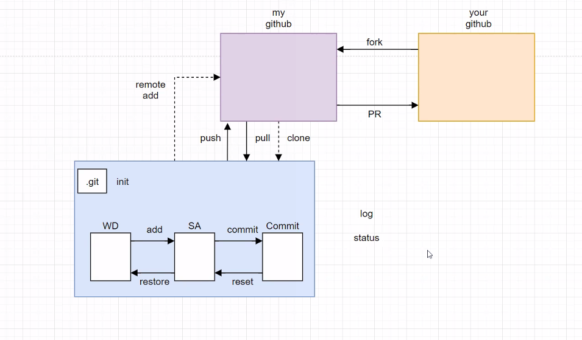

# Git command

> git 기본 명령어 정리





##### init

`.git` 폴더를 생성해주는 명령어, 처음 한번만 실행


- 기본 사용법

```bash
git init
```


##### add

working directory에 있는 파일을 staging area에 올리는 명령어


- 기본 사용법
  - file name에 `.`을 입력하면 모든 파일, 폴더를 한번에 올림

```bash
git add <file name>
```


##### commit

staging area에 있는 파일들을 하나의 commit으로 저장하는 명령어


- 기본 사용법
  - `-m`: 커밋 메시지를 작성하기 위한 옵션

```bash
git commit -m "message"
```


##### remote

원격저장소를 관리하기 위한 명령어


- add: 원격저장소를 추가

```bash
git remote add origin <remote name> <URL>
```


- remove: 원격저장소를 제거

```bash
git remote remove <remote name>
```


##### push

로컬에 저장되어 있는 커밋들을 원격저장소에 업로드하는 명령어


- 기본 사용법

```bash
git push origin master
```


##### pull

원격저장소에 저장되어 있는 커밋들을 로컬에 업로드하는 명령어


- 기본 사용법

```bash
git pull origin master
```


##### clone

원격이나 로컬에 있는 저장소로부터 커밋을 복사해서 로컬에 복사본을 만드는 명령어


- 기본 사용법

```bash
git clone <URL>
```


##### status

Git의 현재 상태를 확인하는 명령어


- 기본 사용법

```bash
git status
```


##### log

Git의 소스 변경 이력을 출력하는 명령어


- 기본 사용법

```bash
git log
```


