# 출생아수 분석

>  pandas를 활용한 출생아수 분석 및 시각화


- 자료) 인구동향조사: 출생아수(시도/시/군/구)
  - KOSIS 국가통계포털 https://kosis.kr/index/index.do


### 라이브러리

```python
import numpy as np
import pandas as pd
import matplotlib as mp
import matplotlib.pyplot as plt
import seaborn as sns
```


### 데이터 불러오기

```python
df_birth = pd.read_csv('pdsample/population_kosis_1997_2019.csv', encoding='cp949')
```

- `encoding= 'cp949'`: 한글 지원을 위해 windows 계열에서 나온 확장 완성형 코드 조합


### 데이터 확인하기


##### 데이터 일부 확인

데이터의 일부를 확인하여 어떤식으로 구성되어 있는지 확인

- 시군구별, 연도별, 성별 출생아 수 데이터를 가지고 있음

`head(n)`

상위 데이터 n개 반환, 기본값은 5 

```python
df_birth.head()
```

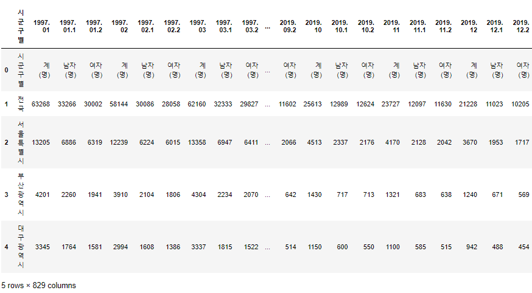

`sample(n)`

데이터 n개를 랜덤으로 추출, 기본값은 1

```python
df_birth.sample(5)
```

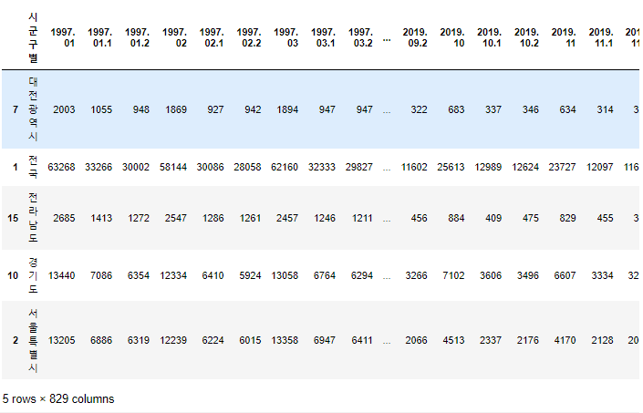


##### 데이터 구조

해당 데이터의 행과 열의 개수를 확인

- 19행 829열로 구성되어 있으며 `melt()`함수로 재구성한 이후에는 15732행 3열로 구성됨

`shape()`

행과 열의 개수를 튜플로 반환

```python
df_birth.shape
```

```python
out:
(19, 829)
```

`melt()`

데이터 프레임을 위에서 아래로 길게 만드는 함수


```python
df_melt = df_birth.melt(id_vars='시군구별')
df_melt.head()
```

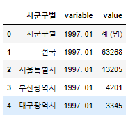

```
df_melt.shape
```

```python
out:
(15732, 3)
```


##### 행 확인

데이터의 카테고리 이름을 확인

- 시군구별, 전국, 서울특별시, 부산광역시 등의 지역 이름을 가지고 있음


`unique()`

고유값을 반환

```python
df_melt['시군구별'].unique()
```

```python
out: 
array(['시군구별', '전국', '서울특별시', '부산광역시', '대구광역시', '인천광역시', '광주광역시', '대전광역시',
       '울산광역시', '세종특별자치시', '경기도', '강원도', '충청북도', '충청남도', '전라북도', '전라남도',
       '경상북도', '경상남도', '제주특별자치도'], dtype=object)
```


- 시군구별은 필요없는 데이터이므로 제외하고 가져옴

```python
df_melt = df_melt[df_melt['시군구별']!='시군구별'].copy()
```

```python
df_melt['시군구별'].unique()
```

```python
out:
array(['전국', '서울특별시', '부산광역시', '대구광역시', '인천광역시', '광주광역시', '대전광역시',
       '울산광역시', '세종특별자치시', '경기도', '강원도', '충청북도', '충청남도', '전라북도', '전라남도',
       '경상북도', '경상남도', '제주특별자치도'], dtype=object)
```


`tail(n)`

하위 데이터 n개 반환, 기본값은 5 

```python
df_melt.tail()
```

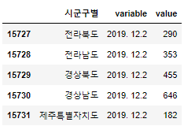

### 데이터 가공하기

##### variable 분리해서 저장

- 연도와 월, 성별이 저장되어 있는 variable 칼럼을 분리해서 따로 저장

```python
df_melt['연도'] = df_melt['variable'].str.split('.', expand=True)[0]
df_melt['월'] = df_melt['variable'].str.split('.', expand=True)[1]
df_melt['성별'] = df_melt['variable'].str.split('.', expand=True)[2]

df_melt.head()
```

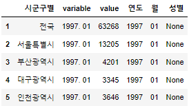

##### 값 변경

- None 값을 채워주고 '1'과 '2'로 나타난 성별을 '남', '여'로 바꾸어줌
- 'variavle'과 'value'를 '기간'과 '출생아수'로 이름을 변경해줌

`fillna`

결측 값을 특정 값으로 대체

```python
df_melt['성별']=df_melt['성별'].fillna('전체')

df_melt.head()
```

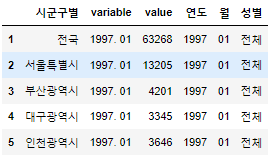

`replace`

기존 값을 특정 값으로 변경

```python
df_melt['성별'] = df_melt['성별'].replace('1','남').replace('2','여')
df_melt['성별'].unique()
```

```python
out:
array(['전체', '남', '여'], dtype=object)
```


`rename`

칼럼의 이름을 변경

```python
df_melt = df_melt.rename(columns={'variable':'기간', 'value':'출생아수'})
df_melt.head()
```

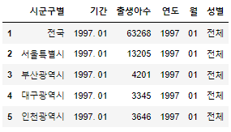

`astype`

데이터 타입을 변환

```
df_melt['출생아수'] = df_melt['출생아수'].astype(float)
```


`info()`

데이터의 대략적인 정보를 나타냄

```python
df_melt.info()
```

```python
out:
<class 'pandas.core.frame.DataFrame'>
Int64Index: 14904 entries, 1 to 15731
Data columns (total 6 columns):
 #   Column  Non-Null Count  Dtype  
---  ------  --------------  -----  
 0   시군구별    14904 non-null  object 
 1   기간      14904 non-null  object 
 2   출생아수    14364 non-null  float64
 3   연도      14904 non-null  object 
 4   월       14904 non-null  object 
 5   성별      14904 non-null  object 
dtypes: float64(1), object(5)
memory usage: 815.1+ KB
```


### 데이터 인덱싱

##### 이름으로 인덱싱

`loc[row, column]`

인덱스 이름을 이용해서 원하는 데이터를 가져옴

```python
df_melt.loc[:,'시군구별']
```

```python
out:
1             전국
2          서울특별시
3          부산광역시
4          대구광역시
5          인천광역시
          ...   
15727       전라북도
15728       전라남도
15729       경상북도
15730       경상남도
15731    제주특별자치도
Name: 시군구별, Length: 14904, dtype: object
```


##### 인덱스 번호로 인덱싱

`iloc[row, column]`

인덱스 번호를 이용해서 원하는 데이터를 가져옴

```python
df_melt.iloc[:,0]
```

```python
out:
1             전국
2          서울특별시
3          부산광역시
4          대구광역시
5          인천광역시
          ...   
15727       전라북도
15728       전라남도
15729       경상북도
15730       경상남도
15731    제주특별자치도
Name: 시군구별, Length: 14904, dtype: object
```


### 기간 별 출생아수 시각화

##### 전국 성별 전체 값 추출

- '시군구별'에서 '전국'이고 '성별'에서 '전체'인 값만 추출해서 저장

```python
df_all = df_melt[(df_melt['시군구별']=='전국') & (df_melt['성별']=='전체')]  

df_all.head()
```

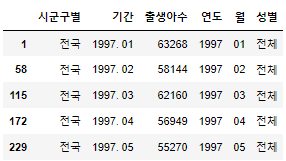

##### 한글화

그래프 내의 폰트가 깨져서 보일때 한글을 지원하는 폰트명으로 재할당해줌

```python
fm = mp.font_manager.FontManager()
plt.rcParams['font.family'] = 'Malgun Gothic'
```


##### 그래프로 표시

- 기간 별 출생아 수를 그래프로 표시

  

`plot`

그래프로 나타내기

- 선 그래프

```python
df_all.set_index(['연도','월']).plot(figsize=(15,4))
```

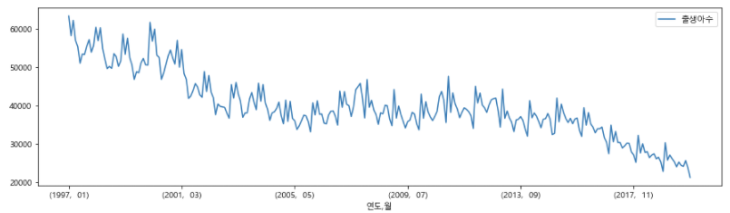

- 막대 그래프

```python
df_all[-24:].set_index(['연도','월']).plot(kind='bar',figsize=(15,4))
```

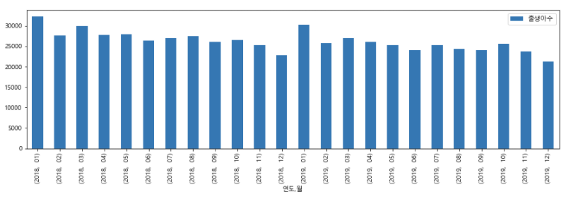


### 지역별 출생아 수 시각화

##### '전국'을 제외하고 데이터 추출

```python
df_local = df_melt[df_melt['시군구별']!='전국'].copy()
df_local.head()
```

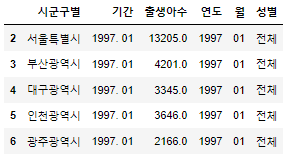

##### '성별'을 모두 '전체'로 변경

```python
df_local_all  = df_local[df_local['성별']=='전체']
df_local_all.head()
```

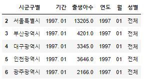

##### 그래프로 표시

- 지역 별 출생아 수를 그래프로 표시

```python
plt.figure(figsize=(15,4))
sns.pointplot(data=df_local_all, x='연도', y='출생아수' , hue='시군구별')

plt.legend(loc='center right', bbox_to_anchor=(1.17, 0.5), ncol=1)
```

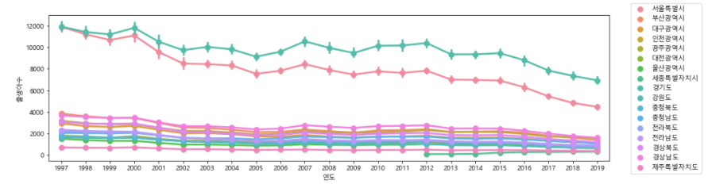