# matplotlib

> python 라이브러리 matplotlib 정리


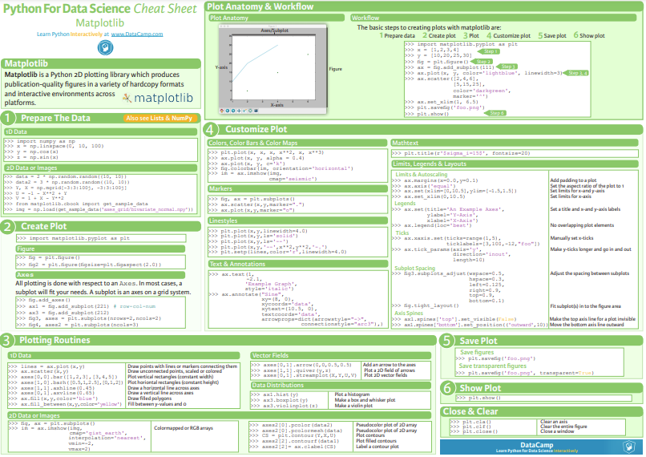

### matplotlib

파이썬에서 데이터를 효과적으로 시각화하기 위해 만든 라이브러리

```python
import matplotlib.pyplot as plt
```

- 별도의 팝업창에서 그래프 출력

```python
%matplotlib qt
```

- 코드결과 출력 부분에 출력

```python
%matplotlib inline
```


### 그래프 그리기

```python
x = np.arange(-3.0, 5)
y1 = 2*x**2
y2 = 4*x
```

##### 하나의 그래프 창에 그리기

```python
plt.plot(x, y1)
plt.plot(x, y2)
```

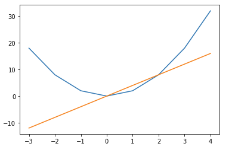

##### 새로운 그래프 창에 그리기

- `n`: 그래프 창 지정

```python
plt.figure(n)
```

```python
plt.plot(x, y1)
plt.figure(facecolor='k')
plt.plot(x, y2)
```

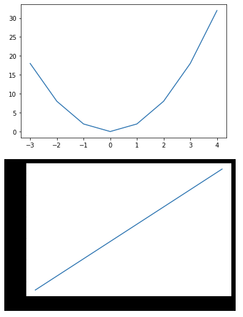

##### 하나의 그래프 창을 하위 영역으로 나눈 후 그리기

- `m x n` 행렬로 이뤄진 하위 그래프 중에서 `p`번 위치에 그래프 생성
- `p`는 왼쪽에서 오른쪽으로, 위에서 아래로 행렬의 위치 지정

```python
plt.subplot(m,n,p)
```

```python
plt.subplot(1,2,1)
plt.plot(x, y1)
plt.subplot(1,2,2)
plt.plot(x, y2)
```

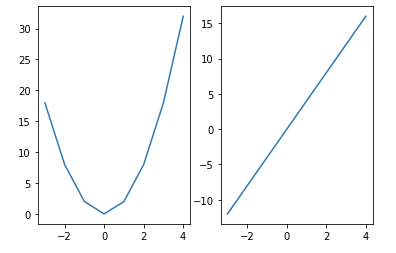

##### 그래프 출력 범위 지정

- x축의 최대, 최솟값과 y축의 최대, 최솟값 지정

```python
plt.xlim(xmin, xmax)
plt.ylim(ymin, ymax)
```


### 그래프 꾸미기

##### 출력 형식 지정

```python
fmt = '[color][line_style][marker]'
```

- `color`: 그래프의 색상 지정

| 약어 |  컬러  |
| :--: | :----: |
|  b   | 파란색 |
|  g   |  녹색  |
|  r   | 빨간색 |
|  c   | 청록색 |
|  m   | 자홍색 |
|  y   | 노란색 |
|  k   | 검은색 |
|  w   |  흰색  |

- `line_style`: 선의 스타일 지정

| 약어 |      스타일      |
| :--: | :--------------: |
|  -   |       실선       |
|  --  |       파선       |
|  :   |       점선       |
|  -.  | 파선 점선 혼합선 |

- `marker`: 마커 지정

|     약어      |                   마커                    |
| :-----------: | :---------------------------------------: |
|       o       |                  원 모양                  |
| ^ / v / < / > | 삼각형 위쪽 / 아래쪽 / 왼쪽 / 오른쪽 방향 |
|       s       |                  사각형                   |
|       p       |                  오각형                   |
|     h / H     |             육각형1 / 육각형2             |
|       *       |                  별 모양                  |
|       +       |                  더하기                   |
|     x / X     |               x / 채워진 X                |
|     D / d     |       다이아몬드 / 얇은 다이아 몬드       |


##### 폰트

- 한글은 보통 'Malgun Gothic'으로 지정
- `axes.unicode_minus`: False로 지정하면 마이너스 폰트가 깨지는 문제 해결

```python
matplotlib.rcParams['font.family'] = '폰트 이름'
```


##### 라벨, 제목, 격자, 범례, 문자열 표시

- 라벨

```python
plt.xlabel()
plt.ylabel()
```

- 제목

```python
plt.title()
```

- 격자

```python
plt.grid()
```

- 범례

```python
plt.legend(data, loc='위치 문자열 / 위치 코드')
```

| 범례 위치           | 위치 문자    | 위치 코드 |
| ------------------- | ------------ | --------- |
| 최적 위치 자동 선정 | best         | 0         |
| 상단 우측           | upper right  | 1         |
| 상단 좌측           | upper left   | 2         |
| 하단 좌측           | lower left   | 3         |
| 하단 우측           | lower right  | 4         |
| 우측                | right        | 5         |
| 중앙 좌측           | center left  | 6         |
| 중앙 우측           | center right | 7         |
| 하단 중앙           | lower center | 8         |
| 상단 중앙           | upper center | 9         |
| 중앙                | center       | 10        |

- 문자열

```python
plt.text(x, y, str)
```


##### style

- 그래프 스타일 목록 확인

```python
plt.style.available
```

```python
out:
['Solarize_Light2',
 '_classic_test_patch',
 'bmh',
 'classic',
 'dark_background',
 'fast',
 'fivethirtyeight',
 'ggplot',
 'grayscale',
 'seaborn',
 'seaborn-bright',
 'seaborn-colorblind',
 'seaborn-dark',
 'seaborn-dark-palette',
 'seaborn-darkgrid',
 'seaborn-deep',
 'seaborn-muted',
 'seaborn-notebook',
 'seaborn-paper',
 'seaborn-pastel',
 'seaborn-poster',
 'seaborn-talk',
 'seaborn-ticks',
 'seaborn-white',
 'seaborn-whitegrid',
 'tableau-colorblind10']
```

- 그래프 스타일 적용

```python
plt.style.use(style)
```


### 그래프 저장

그래프를 이미지 파일로 저장

-  확장자에는 'eps, jpeg, jpg, pdf, pgf, png, ps, raw, rgba, svg, svgz, tif, tiff'가 있음
- `dpi`: dots per inch, 숫자가 클수록 해상도가 높아지고 용량이 커짐

```python
plt.savefig(file_name, [,dpi=dpi_n])
```


### 선 그래프

순서가 있는 데이터를 시각화하거나 시간에 따라 변하는 숫자 데이터를 시각화 하는데 유용

```python
plt.plot([x,] y [,fmt])
```

- `x, y`: x축 좌표와 y축 좌표 각각의 요소만 모아서 만든 시퀀스 데이터
  - x와 y의 시퀀스 길이는 같아야 함
  - x는 생략 가능, 생략하면 0부터 y의 개수만큼 1씩 증가
- `fmt`: format string, 다양한 형식으로 그래프를 그릴 수 있는 옵션

```python
data = [10, 20, 25, 40, 100]
plt.plot(data)
```

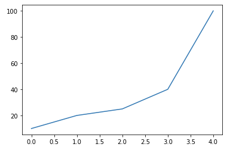


### 산점도

두 개의 요소로 이뤄진 데이터의 집합 관계를 시각화하는 데 유용

- `marker`: 마커의 모양
- `alpha`: 투명도, 0을 지정하면 완전 투명이고 1을 지정하면 완전 불투명

```python
plt.scatter(x, y [,s=size_n, c=colors, marker='marker_string', alpha=alpha_f])
```

```python
height = [168, 155, 170, 173, 180, 160]
weight = [70, 49, 66, 60, 80, 55]

size = 100 * np.arange(1,7)
colors = ['r', 'g', 'b', 'c', 'm', 'k']
plt.scatter(height, weight, s=size, c=colors)
```

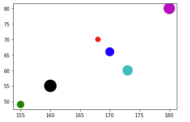


### 막대 그래프

값을 막대의 높이로 나타내므로 여러 항목의 데이터를 서로 비교할 때 이용

- `height`: 막대 그래프의 데이터
- `width`: 폭, [0, 1] 사이의 실수
- `tick_label`: 막대 그래프 각각의 이름 지정
- `align`: 막대 그래프의 위치, center는 가운데이고 edge는 한쪽으로 치우침


##### bar()

세로 막대 그래프

```python
plt.bar(x, height [,width=width_f, color=colors, tick_label=tick_labels, align='center' 혹은 'edge', label=labels])
```

```python
n_len = len(names)
index = np.arange(n_len)

names = ['kim', 'lee', 'park']
before_ko = [88, 72, 65]
after_ko = [95, 80, 90]

plt.bar(index, before_ko, color='r', align='edge', width=0.4, label='before')
plt.bar(index+0.4, after_ko, color='b', align='edge', width=0.4, label='after')
plt.xticks(index+0.4, names)
plt.legend()
```

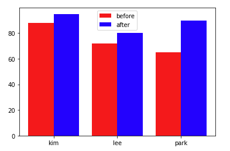

##### barh()

가로 막대 그래프

- width 옵션 사용 불가

```python
n_len = len(names)
index = np.arange(n_len)

names = ['kim', 'lee', 'park']
after_ko = [95, 80, 90]

plt.barh(index+0.4, after_ko, color='b', tick_label=names)
```

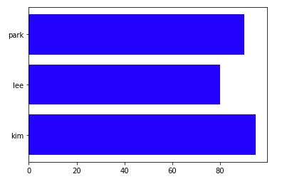


### 히스토그램

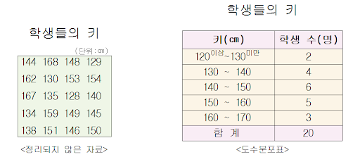

데이터를 정해진 간격으로 나눈 후 그 간격 안에 들어간 데이터 개수를 막대로 표시한 그래프로, 도수분포표를 막대 그래프로 시각화

- `bins`: 계급의 개수

```python
plt.hits(x, [,bins_n 혹은 'auto'])
```

```python
score = [88, 75, 35, 68, 99, 48, 25, 77, 51, 90, 80, 62, 35, 84, 54, 29, 43]
plt.hist(score)
```

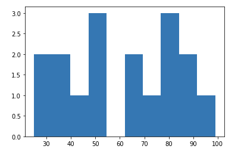

### 파이 그래프

원 안에 데이터의 각 항목이 차지하는 비율만큼 부채꼴의 크기를갖는 영역으로 이뤄진 그래프

- `labels`: 각 부채꼴 부분에 문자열 표시
- `autopct`: 각 부채꼴 부분에 항목의 비율이 표시되는 숫자 형식 지정
- `shadow`: 그림자 효과
- `explod`: 부채꼴 부분이 원에서 돌출되는 효과
- `counterclock`: 부채꼴이 그려지는 순서가 반시계 방향인지 시계 방향인지 지정
- `startangle`: 제일 처음 부채꼴이 그려지는 각도 지정

```python
plt.pie(x, [,labels=labels_seq, autopct='비율 표시 형식', shadow = False 혹은 True, explod = explod_seq, counterclock = True 혹은 False, startangle = 각도])
```

```python
score = ['A', 'B', 'C', 'D', 'F']
result = [20, 30, 30, 10, 10]

explode_v = (0.1, 0, 0, 0, 0)

plt.figure(figsize=(5,5))
plt.pie(result, labels=score, autopct='%.0f%%', explode=explode_v)
plt.show()
```

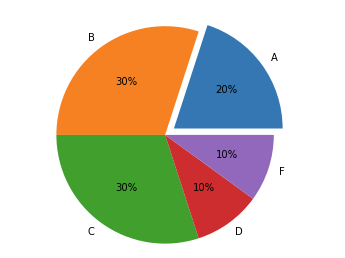

