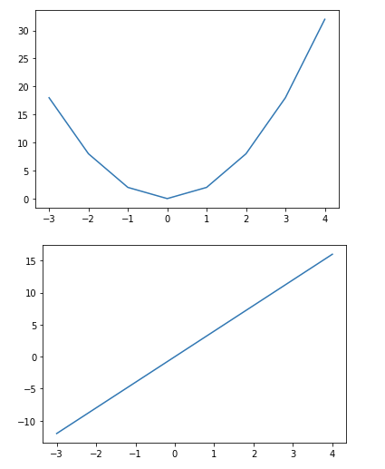

# matplotlib

> python 라이브러리 matplotlib 정리


### matplotlib

파이썬에서 데이터를 효과적으로 시각화하기 위해 만든 라이브러리

```python
import matplotlib.pyplot as plt
```

- 별도의 팝업창에서 그래프 출력

```python
%matplotlib qt
```

- 코드결과 출력 부분에 출력

```python
%matplotlib inline
```


### 선 그래프

```python
plt.plot([x,] y [,fmt])
```

- `x, y`: x축 좌표와 y축 좌표 각각의 요소만 모아서 만든 시퀀스 데이터
  - x와 y의 시퀀스 길이는 같아야 함
  - x는 생략 가능, 생략하면 0부터 y의 개수만큼 1씩 증가
- `fmt`: format string, 다양한 형식으로 그래프를 그릴 수 있는 옵션

```python
data = [10, 20, 25, 40, 100]
plt.plot(data)
```


### 그래프 그리기

```python
x = np.arange(-3.0, 5)
y1 = 2*x**2
y2 = 4*x
```

##### 하나의 그래프 창에 그리기

```python
plt.plot(x, y1)
plt.plot(x, y2)
```


##### 새로운 그래프 창에 그리기

- `n`: 그래프 창 지정

```python
plt.figure(n)
```

```python
plt.plot(x, y1)
plt.figure()
plt.plot(x, y2)
```



##### 하나의 그래프 창을 하위 영역으로 나눈 후 그리기

- `m x n` 행렬로 이뤄진 하위 그래프 중에서 `p`번 위치에 그래프 생성
- `p`는 왼쪽에서 오른쪽으로, 위에서 아래로 행렬의 위치 지정

```python
plt.subplot(m,n,p)
```

```python
plt.subplot(1,2,1)
plt.plot(x, y1)
plt.subplot(1,2,2)
plt.plot(x, y2)
```


##### 그래프 출력 범위 지정

- x축의 최대, 최솟값과 y축의 최대, 최솟값 지정

```python
plt.xlim(xmin, xmax)
plt.ylim(ymin, ymax)
```


### 그래프 꾸미기

##### 출력 형식 지정

```python
fmt = '[color][line_style][marker]'
```

- `color`: 그래프의 색상 지정

| 약어 |  컬러  |
| :--: | :----: |
|  b   | 파란색 |
|  g   |  녹색  |
|  r   | 빨간색 |
|  c   | 청록색 |
|  m   | 자홍색 |
|  y   | 노란색 |
|  k   | 검은색 |
|  w   |  흰색  |

- `line_style`: 선의 스타일 지정

| 약어 |      스타일      |
| :--: | :--------------: |
|  -   |       실선       |
|  --  |       파선       |
|  :   |       점선       |
|  -.  | 파선 점선 혼합선 |

- `marker`: 마커 지정

|     약어      |                   마커                    |
| :-----------: | :---------------------------------------: |
|       o       |                  원 모양                  |
| ^ / v / < / > | 삼각형 위쪽 / 아래쪽 / 왼쪽 / 오른쪽 방향 |
|       s       |                  사각형                   |
|       p       |                  오각형                   |
|     h / H     |             육각형1 / 육각형2             |
|       *       |                  별 모양                  |
|       +       |                  더하기                   |
|     x / X     |               x / 채워진 X                |
|     D / d     |       다이아몬드 / 얇은 다이아 몬드       |


##### 폰트

- 한글은 보통 'Malgun Gothic'으로 지정
- `axes.unicode_minus`: False로 지정하면 마이너스 폰트가 깨지는 문제 해결

```python
matplotlib.rcParams['font.family'] = '폰트 이름'
```


##### 라벨, 제목, 격자, 범례, 문자열 표시

- 라벨

```python
plt.xlabel()
plt.ylabel()
```

- 제목

```python
plt.title()
```

- 격자

```python
plt.grid()
```

- 범례

```python
plt.legend(data, loc='위치 문자열 / 위치 코드')
```

| 범례 위치           | 위치 문자    | 위치 코드 |
| ------------------- | ------------ | --------- |
| 최적 위치 자동 선정 | best         | 0         |
| 상단 우측           | upper right  | 1         |
| 상단 좌측           | upper left   | 2         |
| 하단 좌측           | lower left   | 3         |
| 하단 우측           | lower right  | 4         |
| 우측                | right        | 5         |
| 중앙 좌측           | center left  | 6         |
| 중앙 우측           | center right | 7         |
| 하단 중앙           | lower center | 8         |
| 상단 중앙           | upper center | 9         |
| 중앙                | center       | 10        |

- 문자열

```python
plt.text(x, y, str)
```

