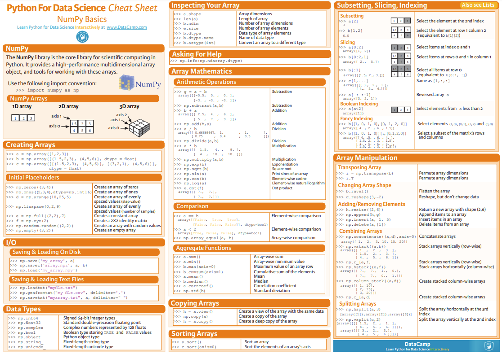

# NumPy

> python 패키지 numpy 정리





### NumPy(Numerical Python)

파이썬으로 과학 연산을 쉽고 빠르게 할 수 있도록 한 패키지

- 다차원 배열 ndarray는 빠른 배열 계산과 유연한 브로드캐스팅 기능 제공
  - `배열`: 순서가 있는 같은 종류의 데이터가 저장된 집합
- 배열 데이터를 디스크에 쓰거나 읽을 수 있고 메모리에 적재된 파일을 다루는 도구
- 선형대수, 난수 생성기 등에 사용

```python
import numpy as np
```


### 배열 생성


##### array()

- 1차원 배열(벡터)

```python
a = np.array([1,2,3,4,5])
a
```

```markdown
out: 
array([1, 2, 3, 4, 5])
```

- 2차원 배열(행렬)

```python
h = np.array([[1,2],[3,4]])
h
```

```markdown
out:
array([[1, 2],
[3, 4]])
```

- 3차원 배열(텐서)

```python
t = np.array([[[1,2],[3,4],[5,6]]])
t
```

```markdown
out:
array(
[[[1, 2],
[3, 4],
[5, 6]]])
```


##### arange()

start부터 시작해서 stop 전까지 step만큼 더해 배열 생성

```markdown
a = np.arange([start,]stop[, step])
```


##### linspace()

start부터 시작해서 stop까지 num개의 배열 생성

```python
l = np.linspace(start, stop[, num])
```

- arrange()와 달리 stop 포함
- num의 기본값은 50


##### zeroz()

모든 원소가 0인 배열 생성

```python
z1 = np.zeroz(n)
z2 = np.zeroz((m,n))
```

- z1은 1차원 배열, z2는 m x n 형태의 2차원 배열
- 메모리를 할당받아 0으로 초기화한 후 반환


##### empty()

앞에서 생성한 크기가 있으면 그대로 복사해서 사용

```python
e = np.empty()
```

- 메모리만 할당받아 0으로 초기화 하지 않고 반환


##### onez()

모든 원소가 1인 배열 생성

```python
o1 = np.onez(n)
o2 = np.onez((m,n))
```

- o1은 1차원 배열, o2는 m x n 형태의 2차원 배열


##### full()

지정한 크기의 배열을 생성하고 채울값 지정

```python
f = np.full((m,n),num)
```


##### eye()

m x n의  행렬에서 주 대각선이 모두 1이고 나머지는 0인 단위행렬 생성

```python
e = np.eye(m,n)
```

- 행과 열의 크기를 지정할 수 있음


##### identity()

n x n의  행렬에서 주 대각선이 모두 1이고 나머지는 0인 단위행렬 생성

```python
i = np.identity(n)
```

- 인자 하나만 지정할 수 있음


##### rand()

실수 난수를 요소로 갖는 배열 생성

```python
r = np.random.rand()
```


##### randint()

정수 난수를 요소로 갖는 배열 생성

- n 전 까지 해당하는 정수

```python
ri = np.random.randint(n)
```


### 배열 분할


##### split()

axis 파라미터를 지정해서 배열을 분할

- axis 기본값은 0

```python
sp = np.arange(12)
sp = np.split(sp,3)
sp
```

```python
out:
[array([0, 1, 2, 3]), array([4, 5, 6, 7]), array([ 8,  9, 10, 11])]
```


##### hsplit()

수평 축으로 배열을 분할

```python
hsp = np.array([[0, 1, 2, 3],
       			[4, 5, 6, 7],
       			[8, 9, 10, 11]])
```

```python
np.hsplit(hsp,2)
```

```python
out:
[array([[0, 1],
        [4, 5],
        [8, 9]]),
 array([[2, 3],
        [6, 7],
        [10, 11]])]
```


##### vsplit()

수직 축으로 배열을 분할

```python
vsp = np.array([[0, 1, 2, 3],
      			[4, 5, 6, 7],
      			[8, 9, 10,11],
      			[12, 13, 14, 15]])
```

```python
np.vsplit(vsp,2)
```

```python
out:
[array([[0, 1, 2, 3],
        [4, 5, 6, 7]]),
 array([[8, 9, 10, 11],
        [12, 13, 14, 15]])]
```


### 배열 결합

```python
st = np.array([[ 0,  1,  2,  3],
       		   [ 4,  5,  6,  7],
       		   [ 8,  9, 10, 11],
       		   [12, 13, 14, 15]])
```

```python
x, y = np.split(a,2, axis=1)
```

```markdown
out:
[[ 0  1]
 [ 4  5]
 [ 8  9]
 [12 13]]
[[ 2  3]
 [ 6  7]
 [10 11]
 [14 15]]
```


##### stack()

차원을 지정해서 결합

```python
np.stack((x,y))
```

```python
out:
array([[[0, 1],
        [4, 5],
        [8, 9],
        [12, 13]],

       [[2, 3],
        [6, 7],
        [10, 11],
        [14, 15]]])
```


##### hstack()

수평 방향으로 결합

```python
np.hstack((x,y))
```

```python
out:
array([[ 0,  1,  2,  3],
       [ 4,  5,  6,  7],
       [ 8,  9, 10, 11],
       [12, 13, 14, 15]])
```


##### vstack()

수직 방향으로 결합

```python
np.vstack((x,y))
```

```python
out:
array([[ 0,  1],
       [ 4,  5],
       [ 8,  9],
       [12, 13],
       [ 2,  3],
       [ 6,  7],
       [10, 11],
       [14, 15]])
```


##### dstack()

결합해서 3차원으로 변경

```python
np.dstack((x,y))
```

```python
out:
array([[[ 0,  2],
        [ 1,  3]],

       [[ 4,  6],
        [ 5,  7]],

       [[ 8, 10],
        [ 9, 11]],

       [[12, 14],
        [13, 15]]])
```

##### 

##### concatenate()

axis 방향에 그대로 결합

```python
np.concatenate((x,y))
```

```python
out:
array([[ 0,  1],
       [ 4,  5],
       [ 8,  9],
       [12, 13],
       [ 2,  3],
       [ 6,  7],
       [10, 11],
       [14, 15]])
```

##### 

### 배열 한 줄로 변경


##### flatten()

- 결과를 return하고 메모리의 값은 변경되지 않음

```python
fl = np.arange(12).reshape(3,4)
fl_r = fl.flatten()
```

```python
out:
array([ 0,  1,  2,  3,  4,  5,  6,  7,  8,  9, 10, 11])
```


### 차원 확장


##### reshape()

- 재할당을 해야 값이 변경
- 음수를 사용하면 shape를 알아서 맞춰줌

```python
re = np.arange(12).reshape(3,4)
```

```python
out:
array([[ 0,  1,  2,  3],
       [ 4,  5,  6,  7],
       [ 8,  9, 10, 11]])
```


##### resize()

- return이 없고 자기 자신을 변경
- 원래의 원소 개수와 맞지 않아도 됨

```python
res.resize(2,3,1)
res
```

```python
out:
array([[[0],
        [1],
        [2]],

       [[3],
        [4],
        [5]]])
    
```


##### newaxis

- 인덱싱할 때 사용

```python
n = np.array([[ 0,  1,  2,  3],
       	      [ 4,  5,  6,  7],
              [ 8,  9, 10, 11]])
```

```python
n[np.newaxis]
```

```python
out:
array([[[ 0,  1,  2,  3],
        [ 4,  5,  6,  7],
        [ 8,  9, 10, 11]]])
```


### 차원 교환


##### swapaxes

차원을 서로 변경

```python
sw = array([[1],
       		[2]])
```

```python
np.swapaxes(sw,0,1)
```

```python
out:
array([[1, 2]])
```


### 배열의 데이터 타입

- 정수와 실수가 혼합된 리스트 데이터는 모두 실수로 변환

```python
a = np.array([0.1,2,3,0.4,0.5])
a
```

```markdown
out: 
array([0.1, 2. , 3. , 0.4, 0.5])
```

```python
print(a.dtype)
```

```markdown
out:
float64
```

- 문자 데이터 역시 하나라도 있으면 전체가 문자로 변환
  - `dtype='<U11'`: 유티코드이며 문자 수는 최대 11개

```python
s = np.array([1,'a',True])
s
```

```markdown
array(['1', 'a', 'True'], dtype='<U11')
```

- NumPy 데이터 형식

| 기호      | 설명                               |
| --------- | ---------------------------------- |
| 'b'       | 논리, bool                         |
| 'i'       | 기호가 있는 정수, integer          |
| 'u'       | 기호가 없는 정수, unsigned integer |
| 'f'       | 실수, floatting-point              |
| 'c'       | 복소수, complex-floating point     |
| 'M'       | 날짜, datetime                     |
| 'O'       | 파이썬 객체, object                |
| 'S' / 'a' | 바이트 문자열, string              |
| 'U'       | 유니코드, Unicode                  |

- astype()

배열의 형을 변환할 때 사용


### NumPy 속성 표현

- `dtype`: 배열 객체의 타입 확인
- `shape`: 배열의 형태 확인

- `ndim`: 배열의 차원 확인
- `size`: 배열의 요소 개수 확인
- `itemsize`: 배열의 요소 당 byte 수 확인


### 배열의 연산

numpy 연산의 기본은 두 개의 shape가 같아야 함


##### 기본 연산

```python
arr1 = [1, 2, 3, 4]
arr2 = [10, 20, 30, 40]
```

- 덧셈

```python
arr1 + arr2
```

```markdown
out:
array([11, 22, 33, 44])
```

- 뺄셈

```python
arr2 - arr1
```

```markdown
out:
array([9, 18, 27, 36])
```

- 곱셈

```python
arr1 * arr2
```

```markdown
out:
array([10, 40, 90, 160])
```

- 나눗셈

```python
arr2 / arr1
```

```markdown
out:
array([10., 10., 10., 10.])
```

- 비교

```python
arr1 > 2
```

```markdown
out:
array([False, False, True, True])
```

### 

##### 통계 연산

| 통계 연산 |   설명    |
| :-------: | :-------: |
|   sum()   |   합계    |
|  mean()   |   평균    |
|   var()   |   분산    |
|   std()   | 표준편차  |
|   min()   |  최솟값   |
|   max()   |  최댓값   |
| cumsum()  | 누적 합계 |
| cumprod() |  누적 곱  |

```python
arr3 = np.arange(5)
arr3
```

```markdown
out:
[0, 1, 2, 3, 4]
```

```python
[arr3.sum(),
arr3.mean(),
arr3.var(),
arr3.std(),
arr3.min(),
arr3.max(),
arr3.cumsum(),
arr3.cumprod()]
```

```markdown
out:
[10,
 2.0,
 2.0,
 1.4142135623730951,
 0,
 4,
 array([ 0,  1,  3,  6, 10], dtype=int32),
 array([0, 0, 0, 0, 0], dtype=int32)]
```


##### 행렬 연산

|            행렬 연산            |   설명   |
| :-----------------------------: | :------: |
|     A.dot(B) / np.dot(A, B)     | 행렬 곱  |
| A.transpose() / np.transpose(A) | 전치행렬 |
|        np.linalg.inv(A)         |  역행렬  |
|        np.linalg.det(A)         |  행렬식  |

```python
A = np.array([0, 1, 2, 3]).reshape(2,2)
B = np.array([3, 2, 1, 0]).reshape(2,2)
```

- 행렬 곱
  - matrix에서 `*`연산자
  - ndarray에서 `@`연산자

```python
A.dot(B)
```

```python
out:
array([[1, 0],
       [9, 4]])
```

- 전치행렬
  - `T`연산자

```python
A.transpose()
```

```python
out:
array([[0, 2],
       [1, 3]])
```

- 역행렬

```python
np.linalg.inv(A)
```

```python
array([[-1.5,  0.5],
       [ 1. ,  0. ]])
```

- 행렬식

```python
np.linalg.det(A)
```

```python
out:
array([[1, 0],
       [9, 4]])
```

```markdown
out:
-2.0
```


#####  broadcasting

모양이 안맞을 때, 특정한 조건에 맞으면 모양을 같게 만들어 연산하는 기능

```python
a = np.array([[ 0,  1,  2,  3],
       	  	  [ 4,  5,  6,  7],
       	   	  [ 8,  9, 10, 11]])
```

```markdown
a + np.array([3,4,5])
```

```python
out:
array([[0, 1, 2],
       [3, 4, 5]])
```


##### axis

다차원 배열을 연산할 때 기준이 되는 축

2차원(axis=0, axis=1) (행, 열)

3차원(axis=0, axis=1, axis=2) (공간, 행, 열)

- 2차원 배열 

```python
a = np.arrayarray([[0, 1, 2, 3],
        		   [4, 5, 6, 7],
        		   [8, 9, 10, 11]])
```

```python
np.sum(a, axis=0) 
```

```markdown
out:
array([12, 15, 18, 21])
```

```
np.sum(a, axis=1)
```

```markdown
out:
array([ 6, 22, 38])
```

- 3차원 배열

    b = np.arrayarray([[[0, 1, 2, 3],
            			[4, 5, 6, 7],
            			[8, 9, 10, 11]],
                        
            		   [[12, 13, 14, 15],
       			  		[16, 17, 18, 19],
        			    [20, 21, 22, 23]]])

```python
np.sum(b, axis=0) 
```

```python
out:
array([[12, 14, 16, 18],
       [20, 22, 24, 26],
       [28, 30, 32, 34]])
```

```python
np.sum(b, axis=1) 
```

```python
out:
array([[12, 15, 18, 21],
       [48, 51, 54, 57]])
```

```python
np.sum(b, axis=2) 
```

```python
out:
array([[ 6, 22, 38],
       [54, 70, 86]])
```


### 배열의 인덱싱과 슬라이싱


##### 인덱싱

배열의 위치나 조건을 지정해 배열의 원소를 선택

- 1차원 배열

```python
배열명[[위치1, 위치2, ...]]
```

- 2차원 배열

```python
배열명[행위치, 열위치]
```

- boolean indexing

  - True에 해당되는 값을 가져옴
  - array만 가능
  - shape가 맞아야 함

- fancy indexing

  - 괄호를 하나 더 넣으면 여러개를 한번에 인덱싱 할 수 있음
  - 내부적으로 copy

  

##### 슬라이싱

범위를 지정해 배열의 원소를 선택

- 1차원 배열

```python
배열명[시작 위치:끝 위치]
```

- 2차원 배열

```python
배열명[행 시작 위치:행 끝 위치, 열 시작 위치:열 끝 위치]
```

