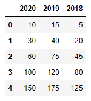
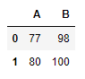
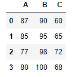
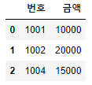
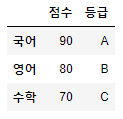

# pandas

> python 패키지 pandas 정리


### pandas

NumPy를 기반으로 만들어져 좀 더 복잡한 데이터 분석에 특화되어있는 패키지

- 데이터 타입이 다양하게 섞여 있을 때도 처리할 수 있음

```python
import pandas as pd
```


### 데이터 생성


##### Series()

라벨을 갖는 1차원 데이터 생성

- `index`: Series에서 세로축 라벨
- `values`: 입력한 데이터

```python
s = pd.Series([10, 20, 30, 40, 50])
s
```

```python
out:
0    10
1    20
2    30
3    40
4    50
dtype: int64
```

- 인덱스 추가하기

```python
i = ['2021', '2020', '2019']
s = pd.Series(['A','B','C'], index = i)
s
```

```python
out:
2021    A
2020    B
2019    C
dtype: object
```

```python
s = pd.Series({'국어':100, '영어':90, '수학':95})
s
```

```python
out:
국어    100
영어     90
수학     95
dtype: int64
```


##### DataFrame()

라벨을 갖는 2차원 데이터 생성

- `index`: DataFrame에서 세로축 라벨
- `columns`: 가로축 라벨
- `values`: 입력한 데이터

```python
s = pd.DataFrame([[1,2,3],[4,5,6]])
s
```


- 인덱스 추가하기

```python
i = ['2021', '2020', '2019', '2018']
c = ['A','B','C']
data = np.array([[100,90,95],[80,85,90],[95,70,80],[90,100,75]])
s = pd.DataFrame(data, index = i, columns=c)
s
```


```python
datas = {'연도': [2021, 2020, 2019],
         '등급': ['A', 'B', 'C']}
pd.DataFrame(datas)
```


##### data_range()

날짜를 자동으로 생성

```python
pd.data_range(start=None, end=None, periods=None, freq='D')
```

```python
pd.data_range(start='2021-01-01', end='2021-01-15', periods=3)
```

```python
out:
DatetimeIndex(['2021-01-01', '2021-01-08', '2021-01-15'], dtype='datetime64[ns]', freq=None)
```

- freq 옵션

|  약어   |                             설명                             |
| :-----: | :----------------------------------------------------------: |
|    D    |                   달력 날짜 기준 하루 주기                   |
|    B    |               업무 날짜(월~금) 기준 하루 주기                |
|    W    | 요일 시작(일요일 = 'W' / 'W-SUN', 월요일 = 'W-MON') 기준 일주일 주기 |
|    M    |                     월말 날짜 기준 주기                      |
|   BM    |                   업무 월말 날짜 기준 주기                   |
|   MS    |                     월초 날짜 기준 주기                      |
|   BMS   |                   업무 월초 날짜 기준 주기                   |
|    Q    |                    분기 끝 날짜 기준 주기                    |
|   BQ    |                 업무 분기 끝 날짜 기준 주기                  |
|   QS    |                   분기 시작 날짜 기준 주기                   |
|   BQS   |                업무 분기 시작 날짜 기준 주기                 |
|    A    |                    일년 끝 날짜 기준 주기                    |
|   BA    |                 업무 일년 끝 날짜 기준 주기                  |
|   AS    |                   일년 시작 날짜 기준 주기                   |
|   BAS   |                업무 일년 시작 날짜 기준 주기                 |
|    H    |                        시간 기준 주기                        |
|   BH    |               업무 시간 기준 주기(09:00~17:00)               |
| T / min |                           분 주기                            |
|    S    |                           초 주기                            |


### 데이터 연산

생성한 데이터 끼리는 서로의 크기가 달라도 연산할 수 있음

```python
s1 = pd.Series([1, 2, 3, 4])
s2 = pd.Series([10, 20, 30])
```


- 덧셈

```python
s1 + s2
```

```python
out:
0    11.0
1    22.0
2    33.0
3     NaN
dtype: float64
```

- 뺄셈

```python
s2 - s1
```

```python
out:
0     9.0
1    18.0
2    27.0
3     NaN
dtype: float64
```

- 곱셈

```python
s1 * s2
```

```python
out:
0    10.0
1    40.0
2    90.0
3     NaN
dtype: float64
```

- 나눗셈

```python
s2 / s1
```

```python
out:
0    10.0
1    10.0
2    10.0
3     NaN
dtype: float64
```


##### 통계 연산

| 통계 연산 |   설명    |
| :-------: | :-------: |
|   sum()   |   합계    |
|  mean()   |   평균    |
|   var()   |   분산    |
|   std()   | 표준편차  |
|   min()   |  최솟값   |
|   max()   |  최댓값   |
| cumsum()  | 누적 합계 |
| cumprod() |  누적 곱  |

```python
datas = {2020: [10,20,30,40,50],
     	 2019: [15,25,35,45,55],
      	 2018: [5,15,25,35,45]}
df = pd.DataFrame(datas)
df
```


```python
df.sum()
```

```python
out:
2020    150
2019    175
2018    125
dtype: int64
```

```python
df.mean()
```

```python
out:
2020    30.0
2019    35.0
2018    25.0
dtype: float64
```

```python
df.mean(axis=1)
```

```python
out:
0    10.0
1    20.0
2    30.0
3    40.0
4    50.0
dtype: float64
```

```python
df.var()
```

```python
out:
2020    250.0
2019    250.0
2018    250.0
dtype: float64
```

```python
df.std()
```

```python
out:
2020    15.811388
2019    15.811388
2018    15.811388
dtype: float64
```

```python
df.std(axis=1)
```

```python
out:
0    5.0
1    5.0
2    5.0
3    5.0
4    5.0
dtype: float64
```

```python
df.min()
```

```python
out:
2020    10
2019    15
2018     5
dtype: int64
```

```python
df.max()
```

```python
out:
2020    50
2019    55
2018    45
dtype: int64
```

```python
df.cumsum()
```



```python
df.cumprod()
```


##### describe()

기초적인 통계분석을 해줌

- 데이터가 숫자로 된 컬럼만 가져옴
  - `include`: 분석할 데이터 타입 지정할 수 있음 (모든 타입의 경우 all)

```python
df.describe()
```


### 데이터 확인

```python
datas = {'봄': [15,18,16,20,22],
     	 '여름': [26,30,28,32,34],
      	 '가을': [15,13,17,12,9],
         '겨울': [5,2,3,-2,-5]}
df = pd.DataFrame(datas)
df
```


##### info()

```python
df.info()
```

```python
out:
<class 'pandas.core.frame.DataFrame'>
RangeIndex: 5 entries, 0 to 4
Data columns (total 4 columns):
 #   Column  Non-Null Count  Dtype
---  ------  --------------  -----
 0   봄       5 non-null      int64
 1   여름      5 non-null      int64
 2   가을      5 non-null      int64
 3   겨울      5 non-null      int64
dtypes: int64(4)
memory usage: 288.0 bytes
```


##### head(n)

전체 데이터 중 처음 n개 반환

```python
df.head(3)
```


##### tail(n)

전체 데이터 중 마지막 n개 반환

```python
df.tail(3)
```


##### sample(n)

랜덤으로 n개의 값을 반환

```python
df.sample(3)
```


##### value_counts()

unique한 값과 그 개수를 알려줌

- Series에서만 사용 가능


### 데이터 선택

##### 슬라이싱

```python
df[1:3]
```


##### 인덱싱

- `loc`: 이름을 이용해서 데이터를 가져옴

```python
df.loc[:,'봄']
```

```python
out:
0    15
1    18
2    16
3    20
4    22
Name: 봄, dtype: int64
```

- `iloc`: 인덱스를 이용해서 데이터를 가져옴

```python
df.iloc[1]
```

```python
out:
봄     15
여름    26
가을    15
겨울     5
Name: 0, dtype: int64
```

- `at`: 이름을 이용해서 한 위치의 값만 가져옴

  - 슬라이싱을 사용할 수 없음

  ```python
  df.at[2,'봄']
  ```

  ```python
  out:
  16
  ```

- `iat`: 인덱스를 이용해서 한 위치의 값만 가져옴

  - 슬라이싱을 사용할 수 없음

  ```python
  df.iat[0,1]
  ```

  ```python
  out:
  26
  ```

  

##### transpose(전치)

DataFrame 데이터의 행과 열을 바꿈

```python
df.T
```


### 데이터 통합

```python
df1 = ({'A':[87,85],
        'B':[90,95]})
df2 = ({'A':[77,80],
        'B':[98,100]})
```

```python
df1
```


```python
df2
```



##### append()

columns가 같은 두 데이터를 세로 방향으로 통합

- 데이터가 없으면 NaN으로 채워짐

```python
df1.append(df2)
```


- `ignore_index`: 생성된 데이터에서 순차적으로 index 증가

```python
df1.append(df2, ignore_index=True)
```


##### join()

index가 같은 두 데이터를 세로 방향으로 통합

- 데이터가 없으면 NaN으로 채워짐

```python
dfs = df1.append(df2, ignore_index=True)

df3 = pd.DataFrame({'C':[60,65,72,68]})
dfs.join(df3)
```



##### merge()

공통된 열이 있을 때, 열을 기준으로 통합

- `how`: 지정된 특정 열을 기준으로 통합 방법

| 인자  |                             설명                             |
| :---: | :----------------------------------------------------------: |
| left  | 왼쪽 데이터는 모두 선택하고 지정된 열에 값이 있는 오른쪽 데이터를 선택 |
| right | 오른쪽 데이터는 모두 선택하고 지정된 열에 값이 있는 왼쪽 데이터를 선택 |
| outer |     지정된 열을 기준으로 왼쪽과 오른쪽 데이터 모두 선택      |
| inner | 지정된 열을 기준으로 왼쪽과 오른쪽 데이터 중 공통 항목만 선택 |

- `on`: 기준이 되는 특정 열의 라벨 이름

```python
df1 = pd.DataFrame({
    '번호': [1001, 1002, 1003],
    '이름': ['A', 'B', 'C']
}, columns=['번호', '이름'])
df1
```


```python
df2 = pd.DataFrame({
    '번호': [1001, 1002, 1004],
    '금액': [10000, 20000, 15000]
}, columns=['번호', '금액'])
df2
```



```python
pd.merge(df1, df2)
```


### 데이터 수정


##### rename()

```python
df = pd.DataFrame({
    '점수': [90, 80, 70],
    '등급': ['A', 'B', 'C']
}, columns=['점수', '등급'])
df
```


```python
df.rename(columns={'등급':'학점'})
df.rename(mapper={'등급':'학점'}, axis=1)
```


```python
df.rename(mapper={0:'국어', 1:'영어', 2:'수학'}, axis=0)
```



##### category

분류할 수 있을 때 사용

- 문자와 숫자 모두 가능

```
df = pd.DataFrame({
    '성별':['여','남','남'],
    '나이':[22, 25, 24]
}, columns=['성별','나이'])
df
```


```python
df['성별']=df['성별'].astype('category')
df.info()
```

```python
out:
<class 'pandas.core.frame.DataFrame'>
RangeIndex: 3 entries, 0 to 2
Data columns (total 2 columns):
 #   Column  Non-Null Count  Dtype   
---  ------  --------------  -----   
 0   성별      3 non-null      category
 1   나이      3 non-null      int64   
dtypes: category(1), int64(1)
memory usage: 279.0 bytes
```


### 데이터 파일


##### 파일 읽기

```python
pd.read_csv(file name [, options])  	
```

- options
  -  `encoding = 'cp949'`: 한글 읽기
  - `sep = '구분자'`: 콤마가 아닌 경우 구분자 지정
  - `index_col='열 이름'`: 데이터 파일에서 특정 열을 index로 선택
  - `header=None`: 지정하지 않으면 첫 행을 컬럼명으로 지정

##### 파일 저장하기

```
pd.to_csv(file name [, options])  
```

