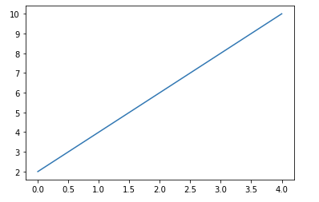
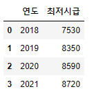
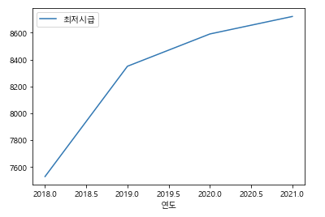
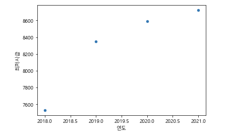
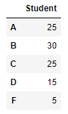
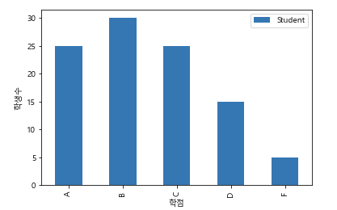
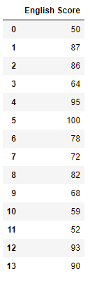
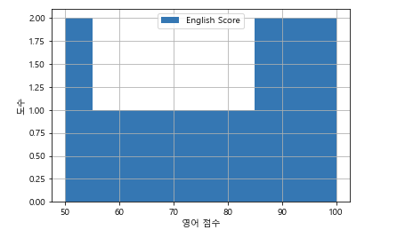
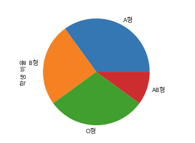

# pandas 시각화

> pandas의 시각화 기능 정리


### pandas의 그래프

pandas의 Series나 DataFrame으로 생성한 데이터가 있을 때 이용

```python
Series_data.plot([kind='graph_kind'][,option])
DataFrame_data.plot([x=label 혹은 position, y=label 혹은 position,][kind='graph_kind'][,option])
```

- `kind`: 그래프의 종류 지정

| 옵션    | 의미                     |
| ------- | ------------------------ |
| line    | 선 그래프(기본)          |
| scatter | 산점도(DataFrame만 가능) |
| bar     | 수직 바 그래프           |
| barh    | 수평 바 그래프           |
| hist    | 히스토그램               |
| pie     | 파이 그래프              |


### 선 그래프

##### Series()

```python
s = pd.Series([2,4,6,8,10])
s.plot()
```



##### DataFrame()

```python
x = [2018, 2019, 2020, 2021]
y = [7530, 8350, 8590, 8720]
data = {'연도':x, '최저시급':y}
df = pd.DataFrame(data)
df
```



```python
df.plot(x='연도', y='최저시급')
```




### 산점도

```python
df.plot.scatter(x='연도', y='최저시급')
```



### 막대 그래프

```python
grade = ['A', 'B', 'C', 'D', 'F']
num = [25, 30, 25, 15, 5]

df = pd.DataFrame(num, grade, columns=['Student'])
df
```



```python
g_bar = df.plot.bar()
g_bar.set_xlabel('학점')
g_bar.set_ylabel('학생수')
```




### 히스토그램

```python
score = [50, 87, 86, 64, 95, 100, 78, 72, 82, 68, 59, 52, 93, 90]
df = pd.DataFrame(score, columns=['English Score'])
df
```



```python
s_bar = df.plot.hist(grid=True)
s_bar.set_xlabel('영어 점수')
s_bar.set_ylabel('도수')
```



### 파이 그래프

```python
blood = ['A형', 'B형', 'O형', 'AB형']
result = [35, 25, 30, 10]

df = pd.Series(result, index=blood, name='학생 비율')
df
```

```python
out:
A형     35
B형     25
O형     30
AB형    10
Name: 학생 비율, dtype: int64
```

```python
df.plot.pie()
```



### 그래프 저장

```python
plt.savefig()
```

