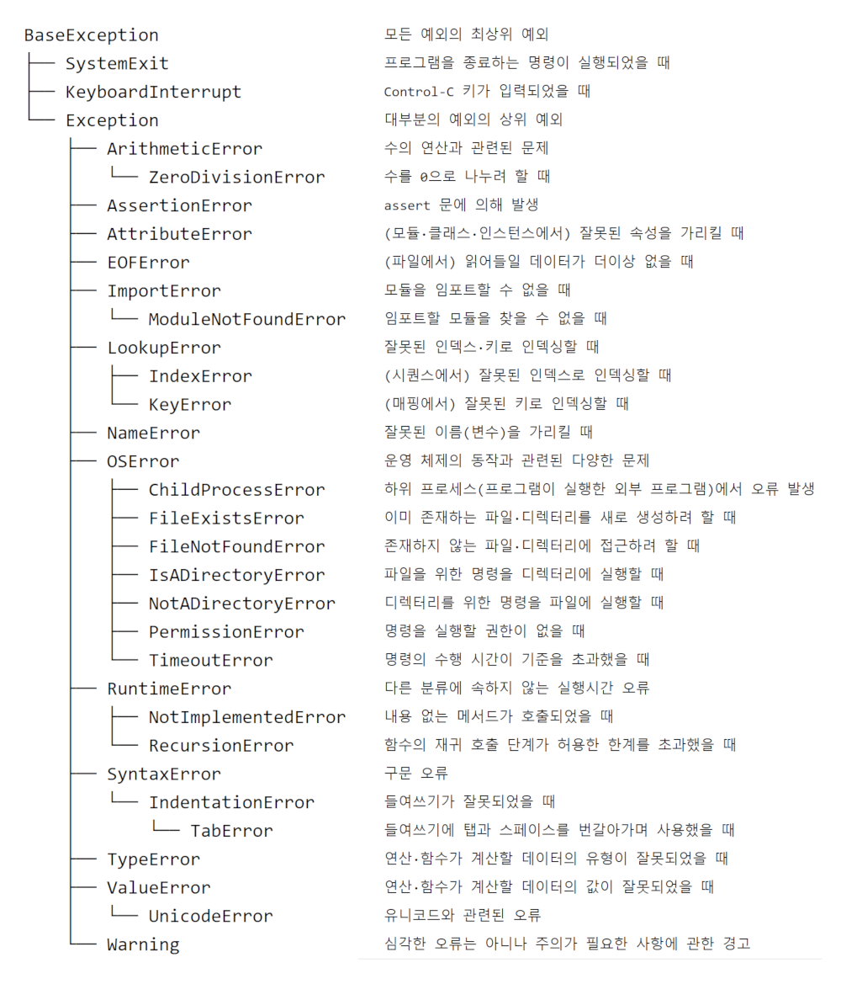

# 예외처리

> python 예외처리 정리


##### 예외(exception)

문법적으로 문제가 없는 코드를 실행하는 중에 더 이상 진행할 수 없는 상황이 발생하는 경우

- 예외 종류



##### 예외처리(exception handing)

예외가 발생했을 때 프로그램이 정상적으로 종료될 수 있도록 예외가 발생되는 곳에서 해주는 기능

- 예외처리문
  - `raise`: 프로그래머가 의도적으로 예외를 발생시켜야 하는 경우 사용
  - `as`: 예외의 종류를 간단한 변수로 나타낼 때 사용

```python
try:
    <예외가 발생할 수 있는 코드>
except:
    <예외가 있을 경우 실행할 코드>
else:
    <아무런 예외가 없을 경우 실행할 코드>
finally:
    <무조건 실행할 코드>
```

