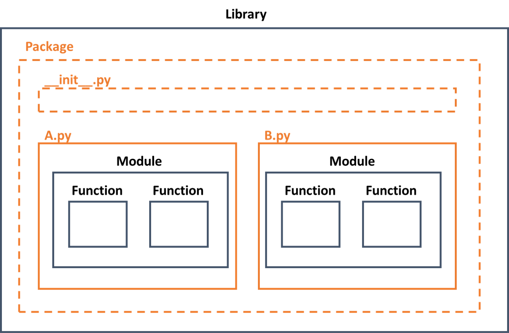

# 모듈 정리

> python 모듈 정리





### 패키지(Package)

모듈을 모아 놓은 단위


##### 패키지의 구조

파이썬 패키지는 폴더 구조로 되어 있으며 각 폴더에는 `__init__.py` 파일이 존재함

-  `__init__.py`은 패키지를 가져올 때 자동으로 실행


### 모듈(Module)

상수, 변수, 함수, 클래스를 포함하는 코드가 저장된 파일

- 장점
  - 코드 작성과 관리가 쉬워짐
  - 이미 작성된 코드를 재사용할 수 있음
  - 공동 작업이 편리해짐


##### 모듈 생성

- '모듈이름.py'로 저장
  - Jupyter Notebook에서 `%%writefile`을 통해 생성 및 저장 가능
    - `-a`: 사용하지 않을 경우 같은 이름의 파일이 있으면 덮어쓰고, 사용하면 기존 파일의 내용 뒤에 추가함


##### 모듈 불러오기

- import 모듈명
  - import 후에는 `모듈명.변수`, `모듈명.함수()`,`모듈명.클래스()`와 같은 형식으로 사용
  - Jupyter Notebook에서 `%load`를 통해 불러올 수 있음
    - `%run`: 파이썬 코드파일 실행
  - `as`: 모듈, 변수, 함수, 클래스명에 별명을 붙임
- from 모듈명 import 변수명/함수명/클래스명
  - 모듈명 없이 직접 호출해서 이용할 수 있음
- from  모듈명 import *
  - `*(asterisk)`는 이름이 언더바로 시작하는 것 빼고 모두 가져옴
  - 여러 모듈을 불러올 때 함수명이 동일 하면 나중에 선언해서 불러온 모듈의 함수가 호출됨


##### 모듈을 직접 실행하는 경우와 import한 후 실행하는 경우 구분

- `__name__`: 모듈의 이름을 나타내는 내장 변수

```python
if __name__ == "__main__":
    <직접 수행할 때만 실행되는 코드>
else:
    <import 했을 때만 실행되는 코드>
```


### 내장 모듈


##### random

임의의 숫자를 생성하는 모듈

|         random 모듈 함수          |                        설명                        |
| :-------------------------------: | :------------------------------------------------: |
|             random()              |     0.0 <= 실수 < 1.0 범위의 임의의 실수 반환      |
|           randint(a,b)            |        a <= 정수 <= 범위의 임의의 정수 반환        |
| randrange([start,] stop [, step]) | range([start,] stop [, step])에서 임의의 정수 반환 |
|             choice()              |      공백이 아닌 시퀀스에서 임의의 항목 반환       |
|       sample(population, k)       |       모집단에서 중복되지 않는 k개 인자 반환       |

##### datetime

날짜와 시간을 다루는 모듈

| datetime 모듈 클래스 | 설명             |
| -------------------- | ---------------- |
| date()               | 날짜 표현        |
| time()               | 시간 표현        |
| datetime()           | 날짜와 시간 표현 |

- date() 클래스 메서드
  - `today()`: 오늘 날짜를 반환
- datetime() 클래스 메서드
  - `now()`:  오늘 날짜와 현재 시각을 반환

- 포맷 코드

| 코드 | 설명 |
| :--: | :--: |
|  %Y  | 연도 |
|  %m  |  월  |
|  %d  |  일  |
|  %H  |  시  |
|  %M  |  분  |
|  %S  |  초  |


##### calendar

달력을 생성해 출력하고 날짜와 관련된 정보를 구하는 모듈

| calendar 모듈 함수 | 설명                                                       |
| ------------------ | ---------------------------------------------------------- |
| calendar(year)     | 지정된 연도의 전체 달력을 문자열로 반환, 기본값은 3        |
| month              | 지정된 연도와 월의 달력을 문자열로 반환                    |
| monthrange         | 지정된 연도와 월의 시작 요일과 일수 반환                   |
| firstweekday       | 달력에 표시되는 주의 첫 번째 요일값을 반환, 기본값은 월(0) |
| setfirstweekday    | 달력에 표시되는 주의 첫 번째 요일을 지정                   |
| weekday            | 지정된 날짜의 요일 반환                                    |
| isleap             | 지정된 연도가 윤년인지를 판단, 윤년이면 True               |

- 요일을 지정할 때 월요일(0) ~ 일요일(6)

