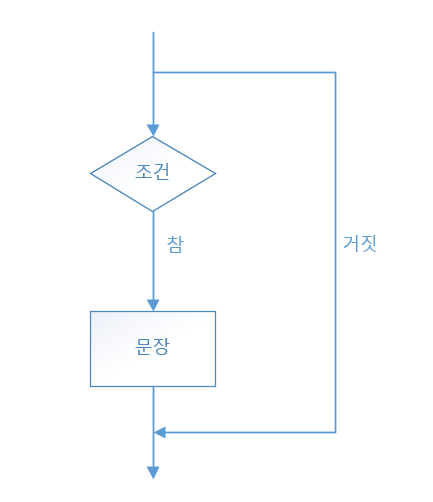
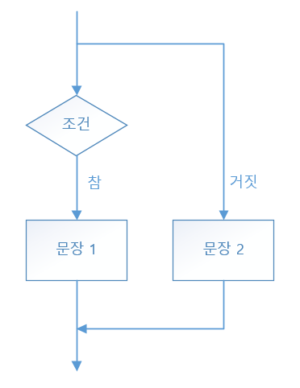
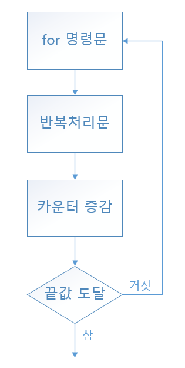

# 제어문

> python 제어문 정리


### 조건문(conditional statement)

조건에 따라 특정 동작을 하도록 하는 프로그래밍 명령어

- `pass`: 코드 블록 안에 지정하면 코드는 실행되지만 아무일도 일어나지 않음


##### if

조건이 참일 때만 수행할 문장이 존재할 때 사용



```python
if <조건식>:
    <코드 블록>
```

```pyth
if score > 60:
	print('합격')
```


##### if ~ else

조건이 참일 때와 거짓일 때 실행할 문장이 다를 때 사용



```python
if <조건식>:
    <코드 블록 1>
else:
    <코드 블록 2>
```

```python
if score > 60:
    print('합격')
else:
    print('불합격')
```


##### if ~ elif ~ else

여러 조건에 따라 코드를 각각 다르게 수행할 때 사용

-1622901829353.png)

```python
if <조건식 1>:
    <코드 블록 1>
elif <조건식 2>:
    <코드 블록 2>
elif <조건식 3>:
    <코드 블록 3>
else:
    <코드 블록 4>
```

```python
if score > 90:
    print('A')
elif score > 80:
    print('B')
elif score > 70:
    print('c')
else:
    print('D')
```


##### if ~ else ~ if ~ else

if 문을 한 번 실행한 후 그 결과에서 if 문을 다시 실행할 때 사용

```python
if <조건식 1>:
    if <조건식 1-1>:
        <코드 블록 1-1>
    else:
        <코드 블록 1-2>
else:
    <코드 블록 2>
```

```python
if score > 40:
    if score > 60:
        print('합격')
    else:
        print('과락')
else:
    print('불합격')
```


### 반복문(loop)

정해진 동작을 반복적으로 수행할 때 내리는 명령어


##### for

기본적인 반복문으로, 반복 범위를 지정하여 반복 수행할 때 사용



```python
for <반복 변수> in <반복 범위>:
    <코드 블록>
```

```python
for a in [1, 2, 3, 4, 5]:
    print(a)
```

- 반복문과 함께 사용되는 함수

  - `range(start, stop, step)`: start부터 시작해서 stop 전까지 step만큼 계속 더해 반복

  ```python
  for i in range(0,6,2):
      print(i)
  ```

  ```markdown
  out: 0
  2
  4
  ```
  - `enumerate()`: 순서 자료형을 입력으로 받아 인덱스를 포함하는 객체 리턴

  ```python
  for i in enumerate([1,2,3]):
      print(i)
  ```

  ```markdown
  out: (0, 1)
  (1, 2)
  (2, 3)
  ```

  - `zip()`: 매개 인자로 여러 목록을 받아 각 목록의 요소를 튜플에 담아 목록에 저장

  ```python
  for i in zip((1, 2),(3, 4)):
      print(i)
  ```

  ```markdown
  out: (1, 3)
  (2, 4)
  ```

- 컴프리헨션(comprehension): list, set, dictionary에서 실행 할 수 있는 한줄 for 문

```python
[<반복 실행문> for <반복 횟수> in <반복 범위> if <조건문>]
```

```python
num = [1, 2, 3, 4, 5]
square = [i**2 for i in num if i>=3]
print(square)
```

```markdown
out: [9, 16, 25]
```


##### while

어떤 조건이 만족하는 동안 반복적으로 수행할 때 사용

```python
while <조건식>:
    <코드 블록>
```

```python
i = 0

while (i < 5):
    i = i + 1
    print(i)
```


##### 무한 반복 while

정해진 동작을 무조건 계속 반복 수행할 때 사용

- 멈추는 방법
  - Jupyter Notebook: 툴바의 `커널 정지(interrupt the kernel)` 
  - 파이썬 콘솔이나 IPython: `Ctrl + C`

```python
while True:
    print('while')
```


### 흐름 제어문

다른 곳으로 조건에 의해 또는 어떤 이유에서 흐름을 이동하는 구문


##### break

문장을 감싸고 있는 가장 가까운 loop의 실행을 중단하고 빠져나감

```python
a = 10
while a>1:
    a -= 1
    if a==5:
        break
    print(a)
```

```markdown
out: 9
8
7
6
```


##### continue

문장을 감싸고 있는 가장 가까운 loop의 조건식으로 돌아가서 검사함

```python
for a in [1, 2, 3, 4, 5]:
    if (a == 2):
        continue
    print(a)
```

```markdown
out: 1
3
4
5
```

