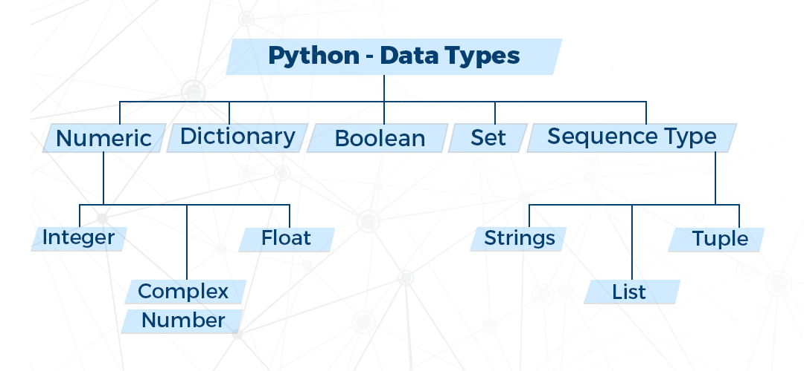

# 자료형

> python 자료형 정리





### Numeric


##### 정수(Integer)

자연수와 자연수의 음수, 0으로 이루어진 수

- 소수점이 없으면 정수

```python
i = 1
type(i)
```

```markdown
out: int
```

- 진법

  - `0b` 2진법(binary): 0~1 값 사용
  - `0o` 8진법(octal): 0~7 값 사용
  - `0x` 16진법(hexadecimal): 0~9와 a~f 값 사용

  

##### 실수(float)

유리수와 무리수로 이루어진 수

- 소수점이 있으면 실수

```python
f = 5.5
type(f)
```

```markdown
out: float
```


##### 복소수(complex)

실수와 허수의 합으로 이뤄진 수

- j는 -1의 제곱근을 표현하는 허수

```python
c = 2 + 3j
type(c)
```

```markdown
out: complex
```


### Boolean


##### 논리(bool)

논리 참(True)이나 논리 거짓(False)를 값으로 취함

- True를 TRUE나 true로 쓰거나 False를 FALSE나 false로 쓸 수 없음
- Boolean은 int를 상속받은 자료형

```python
b = True
type(b)
```

```markdown
out: bool
```

- True는 1, False는 0에 대응

```python
print(True + 1)
print(False + 1)
```

```markdown
out: 2
	 1
```


### Sequence

sequence type은 index와 slice가 가능함

- 대괄호([])로 요소를 꺼내올 수 있음

  - `variable name[시작:끝:간격]`

    

##### 문자열(string)

문자의 나열, 따옴표로 둘러싸인 문자의 집합

- 문자열을 큰 따옴표(")나 작은 따옴표(')로 감싸줌

```python
str1 = 'str test'
str2 = "str test2"
type(str1)
type(str2)
```

```markdown
out: str 
	 str
```

- 문자열 안에 큰 따옴표(")나 작은 따옴표(')를 포함하는 방법
  - 모두 포함하고 싶거나 문장을 여러행 넣고 싶거나 입력한 그대로 출력하고 싶을때는 문자열 전체를 삼중 큰 따옴표(""")나 삼중 작은 따옴표(''')로 감싸줌

```python
str3 = 'str "test3"'
str4 = "str 'test4'"
print(str3)
print(str4)
```

```markdown
out: str "test3"
     str 'test4'
```

- 문자열은 더하기(+)와 곱하기(*)를 이용할 수 있음

  - 더하기(+): 문자열끼리 연결
  - 곱하기(*): 곱한만큼 문자열 반복

  ```python
  str5 = 'str'
  str6 = 'test'
  str_plus = str5 + str6
  print(str_plus)
  print(str5 * 3)
  ```

  ```markdown
  out: strtest
  	 strstrstr
  ```

- 문자열과 같은 sequence는 index와 slice가 가능함

  - name[시작:끝:간격]

  ```python
  str7 = 'str test'
  print(str7[0])
  print(str7[2:5])
  ```

  ```markdown
  out: s
  	 r t
  ```


##### 리스트(list)

- 다양한 타입의 요소를 가지며 순서가 있고 변경이 가능함
- 대괄호([])를 사용하여 생성

```python
l = [1, 2, 3, 4]
type(l)
```

```markdown
out: list
```

- 리스트도 더하기(+)와 곱하기를 이용할 수 있음

```python
list1 = [1, 2, 3, 4]
list2 = [5, 6, 7, 8]
list_plus = list1 + list2
print(list_plus)
print(list1 * 3)
```

```markdown
out: [1, 2, 3, 4, 5, 6, 7, 8]
	 [1, 2, 3, 4, 1, 2, 3, 4, 1, 2, 3, 4]
```

- 리스트 메서드

| 메서드    | 설명                                                  |
| --------- | ----------------------------------------------------- |
| append()  | 리스트에서 항목 하나를 맨 마지막에 추가               |
| insert()  | 리스트에서 특정 위치에 항목을 삽입                    |
| extend()  | 리스트에서 항목 여러 개를 맨 마지막에 추가            |
| remove()  | 입력값과 첫 번째로 일치하는 항목을 리스트에서 삭제    |
| pop()     | 리스트의 마지막 항목을 제거한 후에 반환               |
| index()   | 리스트에서 인자와 일치하는 첫 번째 항목의 위치를 반환 |
| count()   | 리스트에서 인자와 일치하는 항목의 개수를 반환         |
| sort()    | 숫자나 문자열로 구성된 리스트 항목을 순방향으로 정렬  |
| reverse() | 리스트 항목을 끝에서부터 역순으로 정렬                |


##### 튜플(tuple)

- 다양한 타입의 요소를 가지며 순서가 있고 변경이 불가능함

- 소괄호(())를 사용하거나 괄호를 사용하지 않고 생성

  - 소괄호(())를 사용하여 생성하는 방법

  ```python
  t1 = (1, 2, 3, 4)
  type(t1)
  ```

  ```markdown
  out: tuple
  ```

  - 소괄호(()) 없이 생성하는 방법

  ```python
  t2 = 5, 6, 7, 8
  type(t2)
  ```

  ```mark
  out: tuple
  ```

  - 인자가 하나만 있는 튜플을 생성하는 방법

  ```python
  t3 = (9,)
  t4 = 10,
  ```


### set


##### 집합(set)

- 다양한 타입의 요소를 가지며 순서가 없고 변경이 가능함
  - 중복을 허용하지 않음
- 중괄호({})를 사용하여 생성

```python
s = {1, 2, 3, 4, 4}
print(s)
type(s)
```

```markdown
out: {1, 2, 3, 4}
	 set
```

- 집합 메서드와 연산자

|        메서드        | 연산자 |  기호  |
| :------------------: | :----: | :----: |
| 교집합(intersection) |   &    | A ∩ B  |
|    합집합(union)     |   \|   | A ∪ B  |
|  차집합(difference)  |   -    | A － B |


### Dictionary


##### 딕셔너리(dict)

키(key)와 값(value)이 항상 쌍으로 구성

- 다양한 타입의 요소를 가지며 순서가 없고 변경이 가능함

- 중괄호({})와 콜론(:)을 사용하여 생성

```python
d = {1: 10, 2: 20, 3: 30}
type(d)
```

```markdown
out: dict
```

- 딕셔너리 메서드

| 메서드   | 설명                                                      |
| -------- | --------------------------------------------------------- |
| keys()   | 딕셔너리에서 키 전체를 리스트 형태로 변환                 |
| values() | 딕셔너리에서 값 전체를 리스트 형태로 변환                 |
| items()  | 딕셔너리에서 키와 같의 쌍을 (키, 값)처럼 튜플 형태로 변환 |
| update() | 딕셔너리에 딕셔너리 데이터 추가                           |
| clear()  | 딕셔너리의 모든 항목 삭제                                 |


### Container type

여러개의 값을 가지고 있는 데이터 타입

- container의 분류

|            구분            |     예      |    아니오     |
| :------------------------: | :---------: | :-----------: |
| 같은 타입만 요소로 갖는가? | homogeneous | heterogeneous |
|      순서가 중요한가?      |  sequence   | non-sequence  |
|      바뀔 수 있는가?       |   mutable   |   immutable   |

- `in`: 컨테이너 안에 해당하는 값이 있는지 확인

```python
1 in [1, 2, 3, 4]
```

```markdown
out: True
```