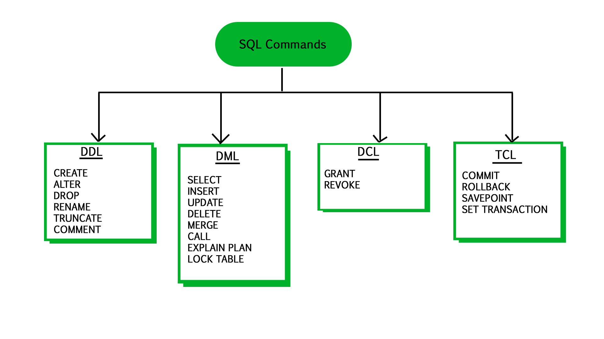

# 데이터 제어어

> SQL 데이터 제어어 정리




### 데이터 제어어(DCL)

- Data Control Language
- DB 관리 및 통제
- DB 백업/복원
- 사용자 등록/권한 관리


### 사용자 및 권한 관리

##### 계정 생성

```mysql
CREATE USER 사용자 계정 IDENTIFIED BY 비밀번호; 
```


##### 계정 삭제

```mysql
DROP USER 사용자 계정;
```


### GRANT

##### 권한 부여

```mysql
GRANT 권한 내용 ON 권한 대상 DB TO 사용자 계정;
```


### REVOKE

##### 권한 철회

```mysql
REVOKE 권한 내용 ON 권한 대상 FROM 사용자 계정;
```

