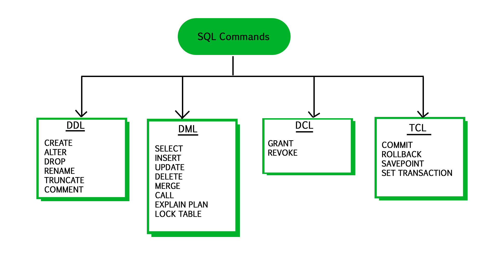

# 데이터 조작어

> SQL 데이터 조작어 정리




### 데이터 조작어(DML)

- Data Manipulation Language
- DB 데이터 관리
- 입력/수정/삭제/검색


### SELECT문

```markdown
5. SELECT 칼럼, 계산 값             
1. FROM 테이블 명                   
2. [WHERE 조건]                     
3. [GROUP BY 그룹화]
4. [HAVING 그룹화에 사용되는 조건]
6. [ORDER BY 정렬];
```


##### SELECT

테이블로부터 데이터를 검색하기 위해 사용

- 특정 열 검색

```sql
SELECT 호출하려는 칼럼
FROM DB명.테이블명;
```

- `*`: 모든 열 검색

```sql
SELECT *
FROM DB명.테이블명;
```

- `AS`: 특정 칼럼의 칼럼명을 변경하고 검색

```sql
SELECT 칼럼명 as 변경 칼럼명
FROM DB명.테이블명;
```

- `DISTINCT`: 중복 행을 제거하고 검색

```sql
SELECT DISTINCT 칼럼명
FROM DB명.테이블명;
```


##### FROM

특정 테이블에 있는 정보를 추출

```sql
SELECT 계산식 또는 칼럼명
FROM DB명.테이블명;
```

```sql
USE DB명;

SELECT 계산식 또는 칼럼명
FROM 테이블명;
```


##### CASE WHEN

조건에 따른 값을 다르게 출력하고 싶은 경우 사용

```sql
SELECT CASE WHEN 조건1 THEN 결과1
WHEN 조건2 THEN 결과 2 ELSE 결과3 END
FROM 테이블명;
```


##### WHERE

조건에 맞는 결과만 검색

```mysql
SELECT 계산식 또는 칼럼명
FROM DB명.테이블명
WHERE 조건식
```

- `BETWEEN`: 시작점부터 끝점까지의 값에 해당하는 결과 검색

```sql
SELECT 계산식 또는 칼럼명
FROM DB명.테이블명
WHERE 칼럼명 BETWEEN 시작점 AND 끝점;
```

- 대소 관계 표현

| 연산자 |   설명    |
| :----: | :-------: |
|   =    | 동일하다  |
|   >    |   초과    |
|   >=   |   이상    |
|   <    |   미만    |
|   <=   |   이하    |
|   <>   | 같지않다. |

- `IS NULL`: 비어 있는 데이터 검색

```sql
SELECT 칼럼명
FROM 테이블명
WHERE 칼럼명 IS NULL;
```

- `IS NOT NULL`: 비어 있지 않은 데이터 검색

```sql
SELECT 칼럼명
FROM 테이블명
WHERE 칼럼명 IS NOT NULL;
```

- `LIKE`: 부분 문자열 포함 여부를 검색하기 위해 사용
  - `_`: 문자열 중 특정 위치에 1개의 모든 문자를 허용
  - `%`: 문자열 중 임의 위치에 0개 이상의 모든 문자를 허용

```sql
SELECT 칼럼명
FROM 테이블명
WHERE 칼럼명 LIKE '_값%';
```


##### 부 질의문(subquery)

질의문 안에 중첩되어 포함된 또 다른 SELECT 검색문

- `IN`: 특정 값과 일치하는 결과만 검색

```sql
SELECT 칼럼명
FROM 테이블명
WHERE 칼럼명 IN (값1, 값2);
```

- `NOT IN`: 특정 값들을 제외한 결과만 검색

```sql
SELECT 칼럼명
FROM 테이블명
WHERE 칼럼명 NOT IN (값1, 값2);
```

- `EXISTS`: 부 질의문에 실행 결과로 반환되는 행이 존재하는지 존재 유무 확인

```sql
SELECT 칼럼명
FROM 테이블명
WHERE EXISTS (SELECT 칼럼명
              FROM 테이블명
              WHERE 조건식);
```


##### GROUP BY

칼럼의 값들을 그룹화해서 검색

```sql
SELECT 칼럼명
FROM 테이블명
GROUP BY 그룹화할 칼럼명;
```

##### 

##### HAVING

GROUP BY절을 통해 생성된 그룹 중에서도 특정 조건을 만족하는 그룹만으로 검색

```sql
SELECT 칼럼명
FROM 테이블명
GROUP BY 그룹화할 칼럼명
HAVING 조건식;
```

##### 

##### ORDER BY

순서를 정해서 검색

```sql
SELECT 칼럼명
FROM 테이블명
ORDER BY 칼럼명 ASC|DESC;
```

- `ASC`: 오름차순 정렬, 기본 값
- `DESC`: 내림차순 정렬


##### 집계 함수

실제 테이블의 저장 값이 아닌 각 열에 대한 기본 통계 결과를 반환해하는 경우 사용

| 집계 함수 | 설명                             |
| --------- | -------------------------------- |
| COUNT()   | 특정 열 값의 개수 또는 행의 개수 |
| MAX()     | 특정 열 값 중에서 최댓값         |
| MIN()     | 특정 열 값 중에서 최솟값         |
| SUM()     | 특정 열 값의 합계                |
| AVG()     | 특정 열 값의 평균                |


##### UNION

서로 다른 SQL 검색문의 결과 집합이 의미적, 형식적으로 일치할 경우 집합 연산자 적용

- 여러 SELECT 명령문의 검색 결과를 결합
- 결과 테이블에서 자동으로 중복 행을 제거한 나머지 행 반환

```sql
SELECT 칼럼명
FROM 테이블명1
WHERE 조건식1
UNION
SELECT 칼럼명
FROM 테이블명2
WHERE 조건식2;
```


##### JOIN

둘 이상의 테이블로부터 연관된 행들의 결합을 통해서 검색 결과를 생성


- LEFT JOIN(LEFT OUTER JOIN): 조인 연산자의 왼쪽 테이블의 모든 행들이 빠짐없이 조인 최종 결과에 포함

```sql
SELECT 칼럼명
FROM 테이블명
LEFT JOIN 테이블명2
ON 테이블명1.컬럼명 = 테이블명2.컬럼명 
```

- RIGHT JOIN(RIGHT OUTER JOIN): 조인 연산자의 오른쪽 테이블의 모든 행들이 빠짐없이 조인 최종 결과에 포함

```sql
SELECT 칼럼명
FROM 테이블명
RIGHT JOIN 테이블명2
ON 테이블명1.컬럼명 = 테이블명2.컬럼명 
```

- INNER JOIN: 조인 연산자의 왼쪽과 오른쪽 테이블의 공통된 행들이 조인 최종 결과에 포함

```sql
SELECT 칼럼명
FROM 테이블명
INNER JOIN 테이블명2
ON 테이블명1.컬럼명 = 테이블명2.컬럼명 
```

- FULL JOIN(FULL OUTER JOIN): 조인 연산자의 왼쪽과 오른쪽 테이블의 모든 행들이 빠짐없이 조인 최종 결과에 포함

```sql
SELECT 칼럼명
FROM 테이블명
FULL JOIN 테이블명2
ON 테이블명1.컬럼명 = 테이블명2.컬럼명 
```


##### 순위 매기기

- RANK: 동점인 경우 같은 등수로 계산, 데이터 세트를 고려해 다음 순위를 매김
- DENSE_RANK: 동점인 경우 같은 등수로 계산, 바로 다음 수로 순위를 매김
- ROW_NUMBER: 동점인 경우도 서로 다른 등수로 계산

| 금액 | RANK | DENSE_RANK | ROW_NUMBER |
| :--: | :--: | :--------: | :--------: |
| 1000 |  4   |     4      |     3      |
| 400  |  2   |     2      |     2      |
| 200  |  1   |     1      |     1      |
| 400  |  2   |     3      |     2      |


### INSERT문

테이블에 새로운 행을 추가할 때 사용

```mysql
INSERT INTO 테이블명
VALUES 값;
```


### UPDATE문

테이블에 존재하는 데이터를 갱신할 때 사용

```mysql
UPDATE 테이블명
SET 변경할 값
[WHERE 변경할 조건식];
```


### DELETE문

테이블에 존재하는 행을 삭제할 때 사용

```mysql
DELETE FROM 테이블명
[WHERE 삭제할 조건식];
```

