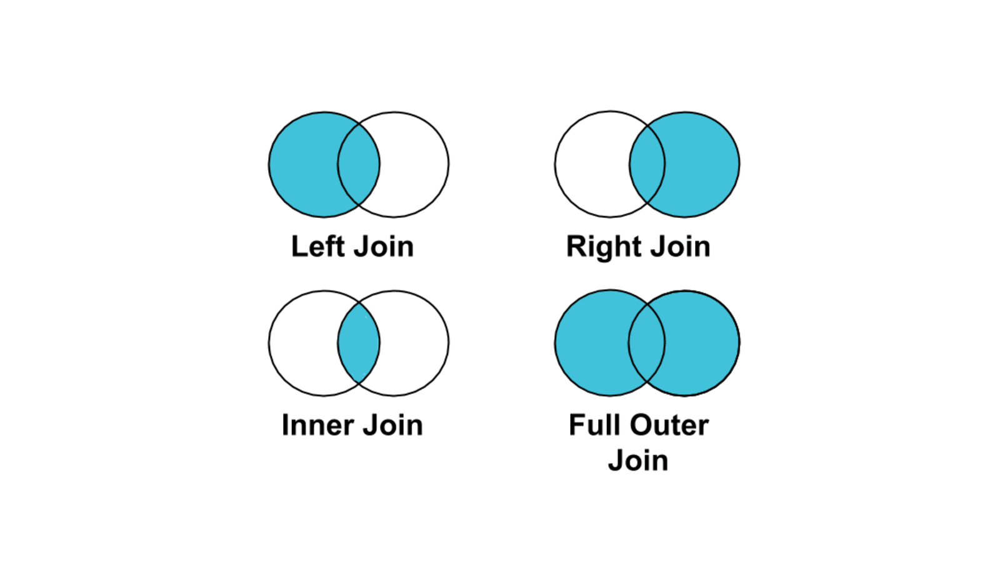

# SQL 문법

> SQL 기본 문법 정리


### SQL

데이터베이스에서 필요한 형태의 데이터를 추출 또는 가공하기 위해 사용하는 언어

```sql
SELECT 칼럼, 계산 값
FROM 테이블 명
WHERE 조건
GROUP BY 그룹화
HAVING 그룹화에 사용되는 조건
```


##### SELECT

- 칼럼 조회

```sql
SELECT 호출하려는 칼럼
FROM DB명.테이블명;
```

- 집계 함수
  - count(): 개수 구하기
  - sum(): 합계
  - avg(): 평균

```sql
SELECT 집계함수
FROM DB명.테이블명;
```

- *: 해당 테이블의 모든 결과 조회

```sql
SELECT *
FROM DB명.테이블명;
```

- AS: 특정 칼럼의 칼럼명 변경해서 조회

```sql
SELECT 칼럼명 as 변경 칼럼명
FROM DB명.테이블명;
```

- DISTINCT: 중복을 제외하고 데이터 조회

```sql
SELECT DISTINCT 칼럼명
FROM DB명.테이블명;
```


##### FROM

특정 테이블에 있는 정보를 추출

```sql
SELECT 계산식 또는 칼럼명
FROM DB명.테이블명;
```

```sql
USE DB명;

SELECT 계산식 또는 칼럼명
FROM 테이블명;
```


##### WHERE

조건을 추가

- BETWEEN

```sql
SELECT 계산식 또는 칼럼명
FROM DB명.테이블명
WHERE 칼럼명 BETWEEN 시작점 AND 끝점;
```

- 대소 관계 표현

| 연산자 |   설명    |
| :----: | :-------: |
|   =    | 동일하다  |
|   >    |   초과    |
|   >=   |   이상    |
|   <    |   미만    |
|   <=   |   이하    |
|   <>   | 같지않다. |

- IN: 특정 값들의 결과를 출력

```sql
SELECT 칼럼명
FROM 테이블명
WHERE 칼럼명 IN (값1, 값2);
```

- NOT IN: 특정 값들을 제외한 결과를 출력

```sql
SELECT 칼럼명
FROM 테이블명
WHERE 칼럼명 NOT IN (값1, 값2);
```

- IS NULL: 비어 있는 데이터 출력

```sql
SELECT 칼럼명
FROM 테이블명
WHERE 칼럼명 IS NULL;
```

- IS NOT NULL: 비어 있지 않은 데이터 출력

```sql
SELECT 칼럼명
FROM 테이블명
WHERE 칼럼명 IS NOT NULL;
```

- LIKE: 특정 필드에 어떤 텍스트가 포함되어 있는 경우 출력

```sql
SELECT 칼럼명
FROM 테이블명
WHERE 칼럼명 LIKE '%값%';
```


##### CASE WHEN

조건에 따른 값을 다르게 출력하고 싶은 경우 사용

```sql
SELECT CASE WHEN 조건1 THEN 결과1
WHEN 조건2 THEN 결과 2 ELSE 결과3 END
FROM 테이블명
```


##### GROUP BY

칼럼의 값들을 그룹화해 계산

```sql
SELECT 칼럼명
FROM 테이블명
GROUP BY 그룹화할 칼럼명
```


##### JOIN

테이블 결합 함수



- LEFT JOIN(LEFT OUTER JOIN): 특정 테이블 정보를 기준으로 타 테이블을 결합

```sql
SELECT 칼럼명
FROM 테이블명
LEFT JOIN 테이블명2
ON 테이블명1.컬럼명 = 테이블명2.컬럼명 
```

- INNER JOIN: 두 테이블에 공통되는 정보만 출력

```sql
SELECT 칼럼명
FROM 테이블명
INNER JOIN 테이블명2
ON 테이블명1.컬럼명 = 테이블명2.컬럼명 
```

- FULL JOIN: 두 테이블에 모두 매칭되는 정보 출력

```sql
SELECT 칼럼명
FROM 테이블명
FULL JOIN 테이블명2
ON 테이블명1.컬럼명 = 테이블명2.컬럼명 
```


##### 순위 매기기

- RANK: 동점인 경우 같은 등수로 계산, 데이터 세트를 고려해 다음 순위를 매김
- DENSE_RANK: 동점인 경우 같은 등수로 계산, 바로 다음 수로 순위를 매김
- ROW_NUMBER: 동점인 경우도 서로 다른 등수로 계산

| 금액 | RANK | DENSE_RANK | ROW_NUMBER |
| :--: | :--: | :--------: | :--------: |
| 1000 |  4   |     4      |     3      |
| 400  |  2   |     2      |     2      |
| 200  |  1   |     1      |     1      |
| 400  |  2   |     3      |     2      |


